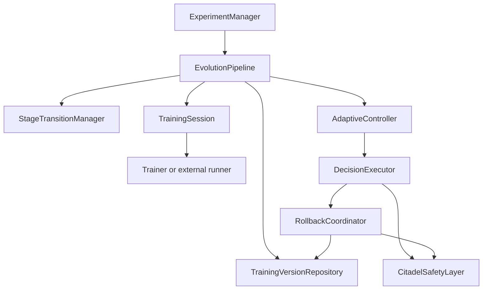
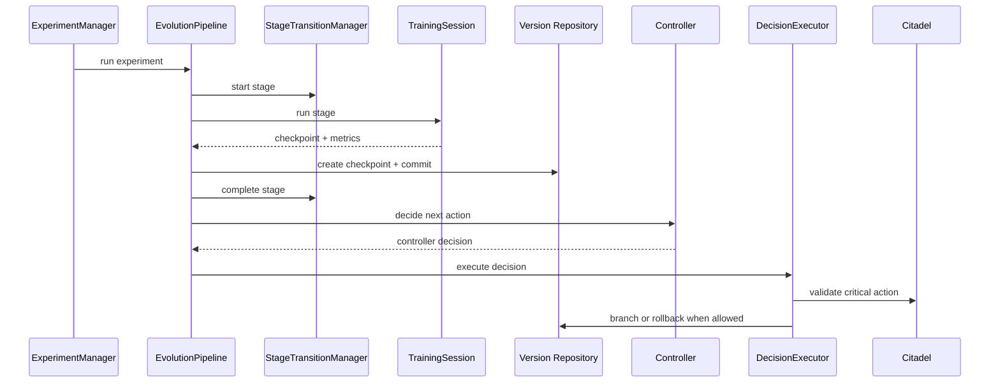

# Experiment Orchestration

ACN orchestration coordinates existing modules without moving their responsibilities.

## Component Flow

## Event Flow

## Boundaries

- `TrainingSession` adapts a synchronous stage runner to orchestration.
- `EvolutionPipeline` owns ordering and state transitions.
- `DecisionExecutor` validates and routes controller decisions.
- `RollbackCoordinator` is the only rollback executor.
- `Trainer`, evaluator and controller remain decoupled from persistence and orchestration.
