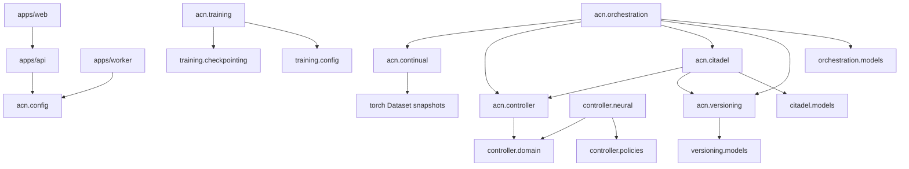

# Architecture Audit Report

Date: 2026-05-18

Scope:
- Python modular monolith packages under `packages/acn/src/acn`
- FastAPI app under `apps/api`
- Worker app under `apps/worker`
- React dashboard under `apps/web`
- Docker Compose, Dockerfiles and environment configuration

## Summary

ACN is structurally consistent with the documented modular monolith direction. The
import graph has no detected cycles, trainer/controller/evaluator responsibilities remain
decoupled, and orchestration coordinates existing modules without owning model training logic.

Safe fixes applied during this pass:
- centralized API/worker logging setup in `acn.config.logging`;
- moved neural policy inference features onto the policy network device;
- switched neural policy state loading to `weights_only=True`;
- changed the web Docker image to use `package-lock.json` and `npm ci`.

## Dependency Graph

Detected import cycles: none.

## Boundary Validation

- API boundary is thin and depends only on configuration today.
- Worker boundary is thin and depends only on shared configuration today.
- Training has no dependency on API, UI, controller, Citadel or versioning.
- Controller has no dependency on API, UI, trainer, versioning persistence or orchestration.
- Citadel depends on controller actions and versioning repository contracts, which is acceptable
  because it validates critical actions against training evolution state.
- Orchestration depends on continual stages, controller decisions, Citadel and versioning
  repositories. This matches its coordinator role.
- Dashboard depends on REST/SSE/WebSocket contracts only; it does not import backend code.

## Duplicated Abstractions

- `IDataSource` and `IStreamSource` overlap intentionally. Stream sources are compatible with
  dataset snapshots but also expose async frame ingestion. Keep both for now.
- API and worker logging setup was duplicated. This was fixed with `acn.config.logging`.
- Small `_dataset_len` helpers exist in continual modules. This is acceptable duplication today
  because each helper guards local Dataset contracts; consider consolidation only if behavior
  starts diverging.

## Async and Sync Boundaries

- Orchestration uses async execution around `TrainingSession.run_stage`.
- Stream ingestion is async, while trainer compatibility is preserved through synchronous
  `Dataset` snapshots.
- Repository implementations are synchronous SQLAlchemy repositories. Orchestration calls them
  synchronously from async flows; acceptable for current local worker execution, but should be
  isolated behind executor/session boundaries before high-concurrency serving.

## Typing and Clean Architecture

- Python strict MyPy passes.
- TypeScript typecheck passes.
- Domain records are mostly dataclasses and Protocols, consistent with the project rules.
- SQLAlchemy models stay in infrastructure-facing modules and do not leak into trainer or
  controller APIs.

## GPU Resource Management

- Trainer resolves CUDA when available and enables AMP only on CUDA.
- Trainer moves batches with `non_blocking=True`, which is compatible with pinned-memory loaders.
- Neural policy offline training can run on a configured device; inference now moves features to
  the network device to avoid CPU/CUDA mismatch after GPU training.
- No distributed training or heavy video inference was introduced.

## Docker and Environment

- Compose includes API, worker, web, PostgreSQL, Redis, MinIO and MLflow.
- `.env.example` covers API, PostgreSQL, Redis, MLflow, MinIO and frontend URLs.
- Docker CLI could not be executed in the audit environment due to a host Docker error, so
  `docker compose config` was not validated at runtime. Static YAML parsing and required service
  checks passed.
- Web Dockerfile now uses `npm ci` with the checked-in lockfile.

## Technical Debt

- `acn.domain` and `acn.services` were removed because they had no concrete ownership.
  `acn.infrastructure` is retained only for concrete UnitOfWork transaction adapters.
- Backend dashboard endpoints now expose the frontend snapshot/SSE/WebSocket contract and can read
  real vertical-slice telemetry from a configured snapshot file.
- Repository methods are synchronous. This is fine for the worker-first architecture, but future
  concurrent API use should avoid blocking event loops.
- Docker healthcheck for MinIO should be verified in a real Docker runtime because this audit
  environment could not execute Docker.
- The stream buffer exposes a synchronous snapshot for trainer compatibility. If ingestion moves
  across threads or processes, replace it with an explicit snapshot handoff owned by the worker.

## Recommendations

1. Implement dashboard REST/SSE endpoints before treating `apps/web` as end-to-end integrated.
2. Add a CI job that runs Python checks, frontend typecheck/build and `docker compose config`.
3. Keep orchestration as the only module that coordinates trainer, controller, Citadel and
   versioning.
4. Avoid introducing new top-level packages unless they have concrete ownership, tests and real
   callers.
5. Add integration tests around repository-backed orchestration once the API/worker lifecycle is
   wired to PostgreSQL.
