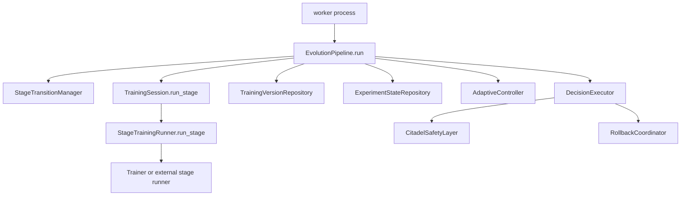

# Sync Execution Model

Date: 2026-05-18

ACN Stage 1 uses a synchronous execution model for orchestration and repository interactions.

## Why Sync-First

The current platform target is a single-node research workstation with an RTX 3060 Laptop GPU and local PostgreSQL/Redis/MLflow/MinIO services. At this scale, the expensive work is GPU training, dataset loading, checkpoint IO and database writes. Async orchestration does not improve those bottlenecks, but it does add complexity when the repositories are synchronous SQLAlchemy repositories.

The sync-first model keeps the platform easier to reason about:

- `EvolutionPipeline.run` is a regular blocking method.
- `TrainingSession.run_stage` calls a synchronous `StageTrainingRunner`.
- Repository protocols remain synchronous.
- Transaction and failure boundaries are easier to define.
- Long-running work is expected to run in the worker process, not inside FastAPI request handlers.

This removes the previous architectural mismatch where async orchestration awaited a stage runner while calling synchronous repositories in the same flow.

## Current Boundary

The trainer remains isolated from orchestration, repositories, API and UI. The controller still only returns decisions. Citadel still validates critical actions before branch or rollback mutation.

## Repository Policy

Repository methods are synchronous by contract:

- `TrainingVersionRepository`
- `ExperimentStateRepository`
- `AuditLogRepository`

Do not add coroutine-returning repository methods for Stage 1. If a future adapter requires async IO, introduce a separate adapter boundary instead of wrapping synchronous SQLAlchemy calls in async functions.

## When Async Becomes Justified

Async or distributed execution becomes justified when ACN needs one or more of these capabilities:

- many concurrent API clients streaming experiment updates;
- multiple workers consuming queued training jobs;
- remote artifact uploads/downloads that dominate request latency;
- non-blocking camera/video ingestion as a first-class training input;
- distributed experiment scheduling across machines;
- long-lived WebSocket/SSE fanout with backpressure handling.

Until then, async in the orchestration layer would mostly hide blocking work rather than remove it.

## Future Distributed Migration Path

Stage 1 should keep the sync domain/application contracts stable and move distribution to process boundaries later:

1. Keep `EvolutionPipeline.run` synchronous.
2. Add a worker-owned job loop that calls the synchronous pipeline.
3. Persist job state and idempotency keys before execution.
4. Use Redis only as a queue/event transport when there is a real worker loop.
5. Emit dashboard events from committed state changes.
6. Add locking around branch head mutations before multiple workers are allowed.
7. Introduce async API streaming only for event delivery, not for core domain mutation.

This path allows future distributed workers without rewriting trainer, controller, Citadel or repository domain contracts.

## Explicit Non-Goals

- No Celery.
- No Ray.
- No Kafka.
- No Kubernetes-specific execution model.
- No async wrapper around synchronous SQLAlchemy repositories.
