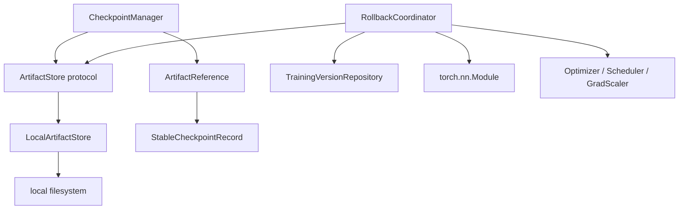
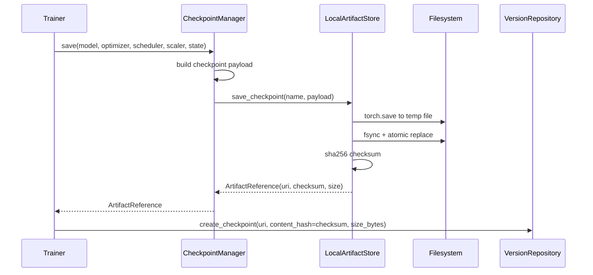
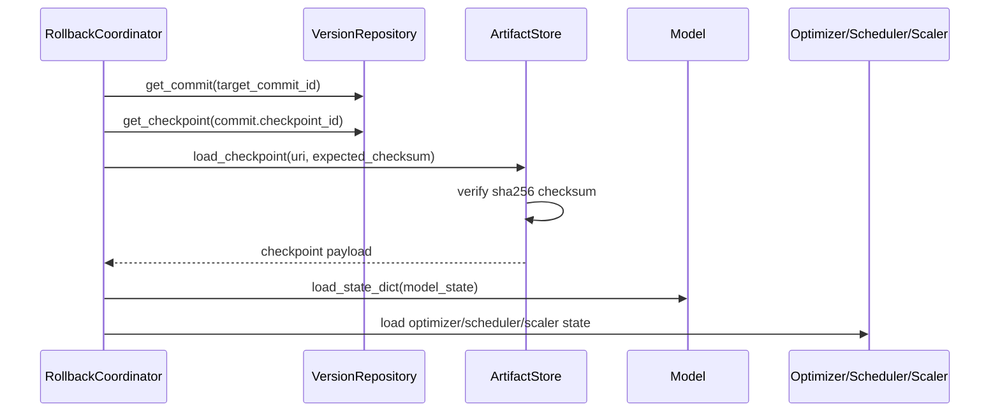
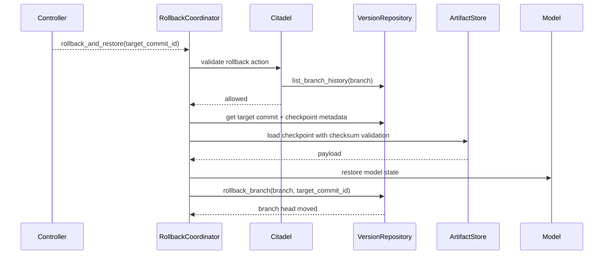

# Artifact Lifecycle

Date: 2026-05-18

ACN now treats checkpoint bytes as first-class artifacts. Rollback must restore actual model state, not only move branch metadata.

## Scope

Stage 1 supports local filesystem artifacts only:

- no MinIO integration yet;
- no async IO;
- no distributed artifact service;
- no remote checkpoint fetch.

The artifact abstraction is intentionally small so MinIO/S3 can be added later behind the same protocol.

## Components

Files:

- `packages/acn/src/acn/artifacts/domain.py`
- `packages/acn/src/acn/artifacts/storage.py`
- `packages/acn/src/acn/artifacts/local.py`
- `packages/acn/src/acn/artifacts/models.py`
- `packages/acn/src/acn/training/checkpointing.py`
- `packages/acn/src/acn/orchestration/rollback.py`

## Artifact Store Contract

`ArtifactStore` provides:

- `save_checkpoint(name, payload) -> ArtifactReference`
- `load_checkpoint(uri, expected_checksum, map_location)`
- `delete_checkpoint(uri)`
- `exists(uri)`
- `checksum(uri)`

`ArtifactReference` contains:

- `uri`
- `checksum`
- `size_bytes`

`LocalArtifactStore` writes checkpoint files atomically with a temporary file and `os.replace`.

## Save Flow

Important invariant:

The stable checkpoint record must reference the actual artifact URI and SHA256 checksum returned by the artifact store.

## Restore Flow

Restore fails before branch movement when:

- artifact is missing;
- checksum does not match;
- checkpoint bytes cannot be loaded;
- model or optimizer state is incompatible.

## Rollback Recovery Flow

Rollback ordering is deliberate:

1. Citadel validates rollback safety.
2. Artifact is located and checksum-verified.
3. Model/optimizer/scheduler/scaler state is restored.
4. Branch head is moved.

This prevents a missing or corrupted artifact from producing a branch pointer that claims recovery succeeded.

## Failure Model

Artifact exceptions:

- `ArtifactNotFoundError`
- `ArtifactChecksumMismatchError`
- `ArtifactCorruptedError`
- `UnsupportedArtifactURIError`

Rollback-specific exception:

- `RollbackRestorationError` when restoration is requested without an artifact store.

Repository rollback errors still apply:

- unreachable target commit;
- missing branch;
- missing commit;
- missing stable checkpoint record.

## Future MinIO Path

MinIO support should be added as a new `ArtifactStore` implementation, not by changing trainer or rollback logic.

Expected migration path:

1. Keep `ArtifactStore` protocol stable.
2. Add `MinioArtifactStore`.
3. Store `s3://...` artifact URIs in `StableCheckpointRecord.uri`.
4. Keep SHA256 checksum validation mandatory.
5. Add integration tests with local MinIO only after local lifecycle remains stable.

