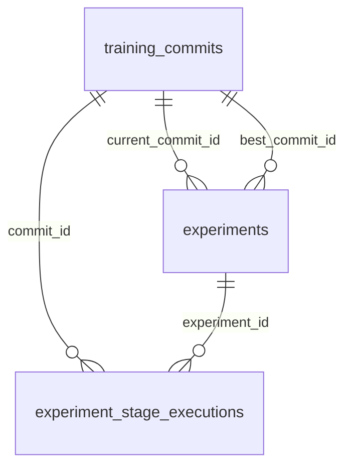
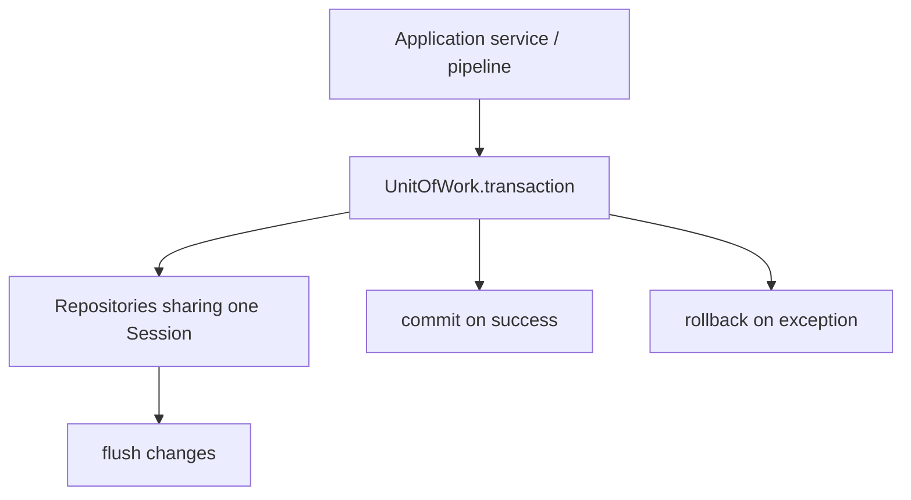
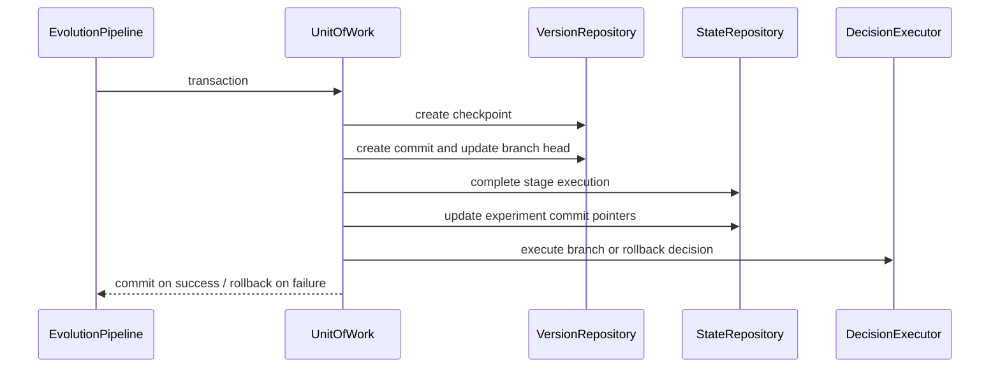
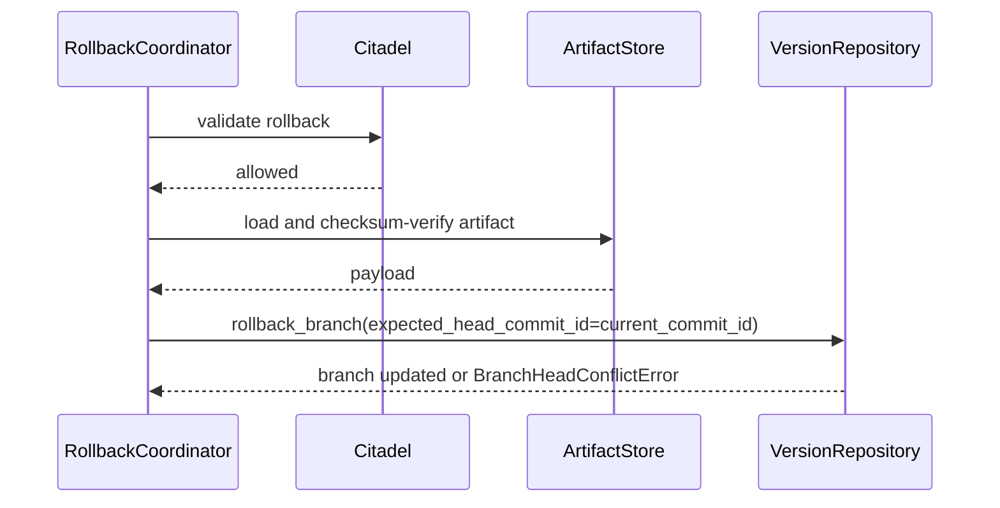

# Transaction and Integrity Model

Date: 2026-05-18

ACN uses synchronous SQLAlchemy repositories and explicit unit-of-work boundaries for Stage 1.

## Goals

- Keep experiment state referentially linked to training commits.
- Keep checkpoint registration, commit creation, branch updates and experiment updates atomic.
- Prevent failed rollback or commit flows from leaving orphaned experiment state.
- Preserve repository boundaries: repositories flush changes but do not own commits.

## Database Integrity

Foreign keys:

- `experiments.current_commit_id -> training_commits.id`
- `experiments.best_commit_id -> training_commits.id`
- `experiment_stage_executions.commit_id -> training_commits.id`
- `experiment_stage_executions.experiment_id -> experiments.id`

Indexes:

- `training_commits.branch_id`
- `training_commits.parent_commit_id`
- `experiment_stage_executions.experiment_id`
- `experiment_stage_executions.commit_id`
- `experiments.current_commit_id`
- `experiments.best_commit_id`

## Unit Of Work

The unit-of-work abstraction lives in `packages/acn/src/acn/infrastructure/uow.py`.

Repositories cooperate with shared transactions by flushing only. They do not call `commit`.

## Orchestration Boundary

`EvolutionPipeline` can receive a `UnitOfWork`. When configured, each stage's mutation block is atomic:

Training itself remains outside the DB transaction. The transaction starts after a stage returns checkpoint metadata and metrics.

## Rollback Safety

Rollback now supports guarded branch-head updates:

- callers pass `current_commit_id`;
- repository verifies the branch head still matches the expected current commit;
- stale rollback attempts raise `BranchHeadConflictError`;
- failed rollback validation or artifact restoration happens before branch head movement.

## Migration

Migration file:

- `infra/db/alembic/versions/20260518_0004_add_experiment_commit_integrity.py`

This migration adds foreign keys and indexes without changing external API contracts.

## Non-Goals

- No distributed transactions.
- No event sourcing.
- No async database layer.
- No queue framework introduced in this step.
