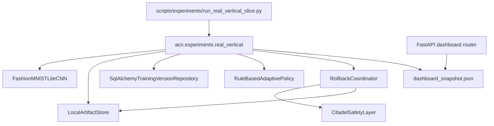
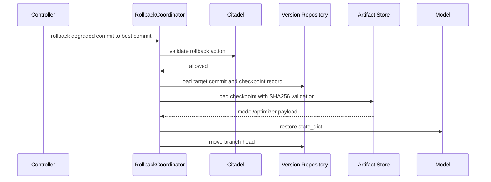

# Real Vertical Slice

This milestone provides the first real ACN adaptive continual-learning loop. It uses
Fashion-MNIST, a lightweight CNN, filesystem checkpoint artifacts, SQLAlchemy version commits,
rule-based degradation detection, Citadel-protected rollback, checkpoint restoration, continued
training, and dashboard-readable telemetry.

## Flow

```mermaid
flowchart LR
    A["Fashion-MNIST train/validation data"] --> B["Baseline training"]
    B --> C["Save checkpoint artifact"]
    C --> D["Create version commit"]
    D --> E["Corrupted stage with LR spike"]
    E --> F["Real metric evaluation"]
    F --> G["Adaptive controller decision"]
    G --> H["Citadel rollback validation"]
    H --> I["Restore checkpoint artifact"]
    I --> J["Continue training"]
    J --> K["Persist telemetry and report"]
    K --> L["Dashboard snapshot/SSE/WebSocket"]
```



## Runtime Components



## Degradation Scenario

The degraded stage performs real training against corrupted samples:

- the optimizer learning rate is intentionally spiked;
- input images receive random noise;
- labels are shifted;
- if validation loss does not degrade enough, model weights are perturbed and validation is
  measured again.

The controller decision is still based on real evaluated metrics. The forced perturbation is used
only to make the milestone deterministic on small local subsets.

## Rollback Recovery



Rollback restores model and optimizer state before moving the branch head. Missing or corrupted
artifacts fail before branch mutation.

## Outputs

The run writes:

- `metrics.json`
- `dashboard_snapshot.json`
- `rollback_events.json`
- `validation_plot.svg`
- `forgetting_plot.svg`
- `adaptation_plot.svg`
- `report.md`
- `rollback_report.md`
- `experiment.db`
- checkpoint artifacts under `artifacts/checkpoints/`

The dashboard backend reads `dashboard_snapshot.json` when `ACN_DASHBOARD_TELEMETRY_PATH` is set.
Without that setting, it returns the empty contract-compatible snapshot.

## Run

```bash
python3.12 scripts/experiments/run_real_vertical_slice.py \
  --config configs/experiments/acn_real_vertical_slice.json
```

To expose the resulting telemetry through the API:

```bash
export ACN_DASHBOARD_TELEMETRY_PATH=experiments/acn-real-fashion-mnist-rollback/dashboard_snapshot.json
uvicorn acn_api.main:app --host 127.0.0.1 --port 8000
```

Then open:

- `GET /api/v1/dashboard/snapshot`
- `GET /api/v1/dashboard/events`
- `WS /api/v1/dashboard/ws`

## Boundaries

This is intentionally still Stage 1:

- local filesystem artifacts only;
- sync SQLAlchemy repositories;
- no Redis requirement for live updates;
- no distributed workers;
- no adaptive neural controller in the critical path.
