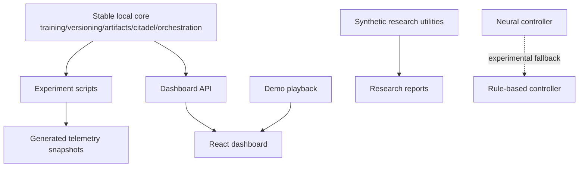

# System Maturity Matrix

This matrix classifies ACN subsystems by implementation maturity. It is intentionally conservative:
production-shaped code is not classified as production-ready until it has real operational use,
observability, failure-mode coverage, migration discipline and security review.

## Status Levels

| Status | Meaning |
| --- | --- |
| Prototype | Useful for proving shape or contracts; not a reliable execution path. |
| Experimental | Real code with tests, but assumptions are not validated enough for default use. |
| Stable local | Suitable for single-node local research on the supported workstation profile. |
| Production-ready | Suitable for managed multi-user operation with hardened observability and failure handling. |

## Subsystem Matrix

| Subsystem | Location | Status | Rationale | Next maturity step |
| --- | --- | --- | --- | --- |
| Trainer core | `packages/acn/src/acn/training` | Stable local | Typed PyTorch loop, checkpoints, optimizers, schedulers and focused tests exist. | Add production telemetry, larger checkpoint compatibility tests and long-run recovery tests. |
| Artifact lifecycle | `packages/acn/src/acn/artifacts` | Stable local | Local filesystem store has deterministic paths, checksums and rollback integration. | Add remote object-store adapter only when MinIO integration is required by a real workflow. |
| Version store | `packages/acn/src/acn/versioning` | Stable local | SQLAlchemy repository, commit graph, branch history and rollback semantics are implemented. | Add PostgreSQL concurrency tests beyond SQLite/local simulations. |
| Citadel safety layer | `packages/acn/src/acn/citadel` | Stable local | Critical rollback/overwrite/stable-checkpoint checks and audit models exist. | Harden audit persistence and operator approval workflow before production use. |
| Rule-based controller | `packages/acn/src/acn/controller/policies.py` | Stable local | Deterministic explainable decisions are covered by tests and used in the real vertical slice. | Tune policy thresholds with real experiment history. |
| Neural controller | `packages/acn/src/acn/controller/neural.py` | Experimental | Policy network exists, but training data and calibration are synthetic/test-scale. | Build a real offline policy dataset and confidence calibration report. |
| Continual learning data abstractions | `packages/acn/src/acn/continual` | Experimental | Stage, replay and evaluation abstractions exist; real dataset coverage is still limited. | Run repeatable Fashion-MNIST/CIFAR domain-shift experiments and document metrics validity. |
| Stream ingestion abstractions | `packages/acn/src/acn/continual/stream.py` | Prototype | Future-facing interfaces exist without real video inference integration. | Keep isolated until a concrete video/camera milestone starts. |
| Orchestration | `packages/acn/src/acn/orchestration` | Stable local | Sync coordinator coordinates repositories, trainer protocols, controller and rollback. | Add more transaction-bound integration tests against PostgreSQL. |
| Unit of Work | `packages/acn/src/acn/infrastructure/uow.py` | Stable local | Concrete transaction boundary adapter justifies the `acn.infrastructure` namespace. | Avoid adding generic infrastructure abstractions without a real adapter. |
| Dashboard backend | `apps/api/src/acn_api` | Experimental | Snapshot/SSE/WebSocket contracts exist and can read real vertical-slice telemetry. | Replace file snapshot loading with repository-backed queries when persistence ownership is stable. |
| Frontend dashboard | `apps/web/src` | Experimental | Typed React dashboard and demo mode exist, but live production data handling is minimal. | Add contract validation and error-state coverage around real API payloads. |
| Worker service | `apps/worker` | Prototype | Process entrypoint exists; no real job ownership or queue semantics yet. | Define one concrete local worker responsibility before adding infrastructure. |
| Synthetic E2E pipeline | `packages/acn/src/acn/experiments/e2e.py` | Experimental | Deterministic CI utility, not a real ML result pipeline. | Keep labeled synthetic and do not use for claims about adaptive training quality. |
| Real vertical slice | `packages/acn/src/acn/experiments/real_vertical.py` | Experimental | Executes real Fashion-MNIST training, rollback and dashboard telemetry, but is a milestone script. | Promote reusable pieces only after two or more real scenarios need them. |
| Research benchmark utilities | `packages/acn/src/acn/experiments/research.py` | Experimental | Generates reproducible comparisons from synthetic profiles. | Replace synthetic profiles with real repeated experiment inputs. |
| Demo playback mode | `apps/web/src/demo`, `scripts/demo` | Prototype | Presentation-oriented assets and frontend playback. | Keep separate from production telemetry and label all outputs as demo artifacts. |
| Docker Compose stack | `docker-compose.yml`, `infra` | Stable local | Local PostgreSQL/Redis/MLflow/MinIO services are available. | Add healthcheck-driven integration tests before production claims. |

## Namespace Decisions

| Namespace | Decision |
| --- | --- |
| `acn.domain` | Removed. Domain types live inside owning modules such as `training`, `controller`, `versioning` and `orchestration`. |
| `acn.services` | Removed. No shared application-service ownership exists yet. Add a concrete package only when two runtimes need the same application service. |
| `acn.infrastructure` | Kept. It owns concrete UnitOfWork transaction adapters and must remain small. |

## Separation Rules

- Production logic is reusable code under `training`, `artifacts`, `versioning`, `citadel`,
  `controller.policies`, `continual` and `orchestration`.
- Demo logic remains under `scripts/demo`, `configs/demo` and `apps/web/src/demo`.
- Synthetic research utilities remain under `acn.experiments.e2e` and `acn.experiments.research`.
- Experimental features must say so in module docs or user-facing docs before being exposed as defaults.
