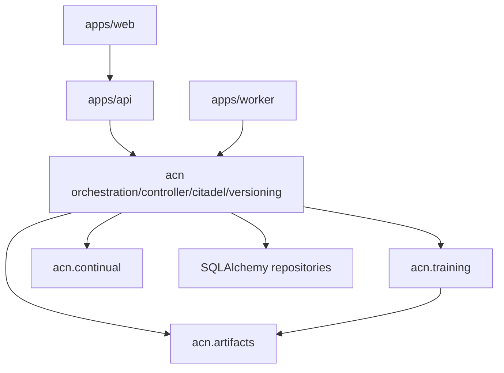

# Development Rules

These rules keep ACN maintainable as a modular monolith. They are guardrails against accidental
microservice design, placeholder abstractions and demo code leaking into production paths.

## Layering

Allowed dependency direction:

| Layer | May depend on |
| --- | --- |
| `apps/web` | HTTP/SSE/WebSocket contracts only. No Python internals. |
| `apps/api` | Settings, repositories, orchestration read models, telemetry contracts. |
| `apps/worker` | Orchestration, training entrypoints and repositories. |
| `acn.orchestration` | Controller, Citadel, versioning, continual stage records, repository protocols and trainer protocols. |
| `acn.training` | PyTorch, artifact store, training config. |
| `acn.controller` | Controller domain models, policies and optional experimental neural policy. |
| `acn.versioning` | SQLAlchemy models/repositories and versioning domain records. |
| `acn.artifacts` | Filesystem artifact storage. |
| `acn.experiments` | May compose production modules for scripts, but must not become required by production modules. |

Forbidden coupling:

- `acn.training` must not import `acn_api`, `apps.web`, frontend contracts or orchestration managers.
- `acn.orchestration` must not import PyTorch implementation types such as `torch`, `DataLoader`,
  `Dataset`, `nn.Module` or optimizers. It coordinates via protocols and records.
- `acn.versioning` must not import trainer, controller or API modules.
- `apps/web/src/demo` must not be treated as live backend data.
- Synthetic experiment modules must not be imported by production API paths.

## Production, Demo, Research and Experimental Code

| Category | Current locations | Rule |
| --- | --- | --- |
| Production-shaped local core | `acn.training`, `acn.artifacts`, `acn.versioning`, `acn.citadel`, `acn.orchestration` | Keep typed, tested and free of demo assumptions. |
| Real experiment scripts | `acn.experiments.real_vertical`, `scripts/experiments/run_real_vertical_slice.py` | May compose core modules, but remain script-level until reuse pressure is clear. |
| Synthetic research utilities | `acn.experiments.e2e`, `acn.experiments.research` | Must be labeled synthetic and must not support empirical claims. |
| Demo playback | `scripts/demo`, `apps/web/src/demo`, `configs/demo` | Presentation-only; do not wire into production data ownership. |
| Experimental ML features | `acn.controller.neural`, stream abstractions | Must provide fallback paths and explicit maturity notes. |

## When Not To Add Infrastructure

Do not add Celery, Ray, Kafka, Kubernetes, event sourcing or distributed transactions while:

- experiments run on one workstation;
- repository calls are synchronous;
- there is no measured local bottleneck;
- the failure mode can be handled by a local transaction, checkpoint and audit record;
- a script or Make target is enough to operate the workflow.

Add new infrastructure only when a concrete workflow proves it needs:

- multiple independent workers;
- resumable queues;
- cross-machine scheduling;
- durable event fanout;
- object-store artifact lifecycle beyond local filesystem;
- production multi-user access control.

## Namespace Rules

- Avoid empty top-level namespaces.
- Add a new `acn.*` package only when it has concrete ownership, tests and at least one real caller.
- Keep domain records close to the subsystem that owns the invariants.
- Prefer protocols at subsystem boundaries only when two implementations or test doubles exist.

## Guardrail Tests

Architecture guardrails live in `tests/architecture/test_architecture_guardrails.py`.

Current checks:

- training cannot import API/UI modules;
- orchestration remains coordinator-only and does not import PyTorch implementation types;
- frontend dashboard contracts remain typed.

When adding a new subsystem boundary, add a lightweight guardrail only if it prevents a likely
coupling mistake. Do not create broad static-analysis frameworks for hypothetical risks.
