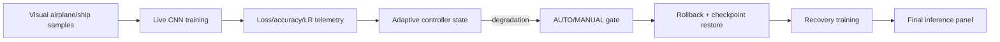
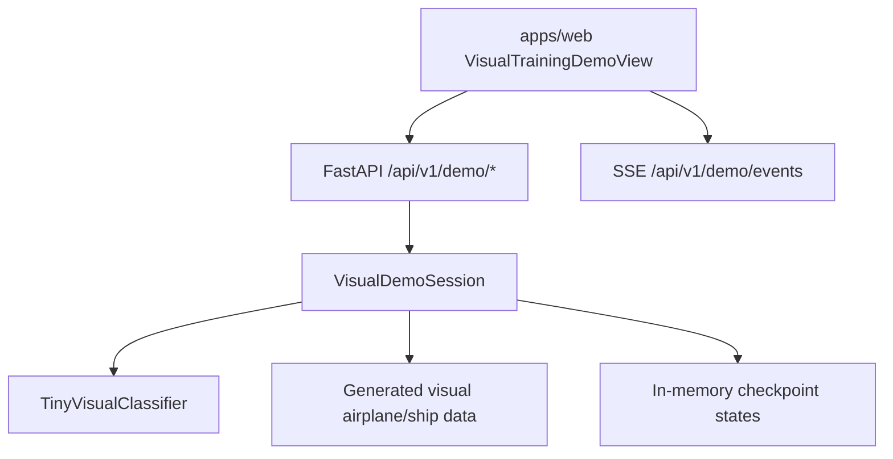

# Visual Demo Architecture

The visual demo turns ACN from a backend-first research platform into a leadership-friendly
demonstration: **watch the neural network learn, fail, recover, adapt and improve**.

This is a demo layer, not a new distributed training architecture.

## Demo Story



The viewer sees:

- current epoch, stage, branch and checkpoint;
- live loss, accuracy and learning-rate curves;
- validation images with predicted class, confidence and correctness;
- checkpoint timeline;
- adaptive event feed;
- AUTO/MANUAL mode;
- manual approve/reject for rollback;
- upload-based final inference against the current model.

## Runtime Components



## Backend

Location:

- `packages/acn/src/acn/experiments/visual_demo.py`
- `apps/api/src/acn_api/visual_demo.py`

The backend owns a single local `VisualDemoSession`.

It provides:

- `GET /api/v1/demo/state`
- `GET /api/v1/demo/events`
- `POST /api/v1/demo/start`
- `POST /api/v1/demo/pause`
- `POST /api/v1/demo/resume`
- `POST /api/v1/demo/rollback`
- `POST /api/v1/demo/auto-mode`
- `POST /api/v1/demo/approve`
- `POST /api/v1/demo/reject`
- `POST /api/v1/demo/predict`

The demo intentionally uses SSE instead of Redis. A single local browser observing a single local
training session does not justify a queue or event bus.

## Dataset

The demo uses lightweight generated visual samples:

- `airplane`
- `ship`

This keeps the demo reliable without dataset downloads while still being visually understandable.
The model is a real small CNN trained with PyTorch; metrics and predictions come from the actual
model state.

## Adaptive Behavior

At the configured degradation stage the demo intentionally applies:

- a learning-rate spike;
- label inversion;
- noisy inputs.

The UI then shows:

1. validation degradation;
2. controller detection;
3. rollback event;
4. checkpoint restoration;
5. learning-rate reduction;
6. recovery training.

Manual mode pauses before rollback and waits for approve/reject. Auto mode executes rollback
without operator approval.

## Frontend

Location:

- `apps/web/src/views/VisualTrainingDemoView.tsx`
- `apps/web/src/hooks/useVisualDemo.ts`
- `apps/web/src/api/visualDemoApi.ts`
- `apps/web/src/types/visualDemo.ts`

The visual demo is the first navigation item in the dashboard.

## Demo Operation

Run API:

```bash
make api
```

Run frontend:

```bash
make web
```

Open:

```text
http://localhost:5173
```

Then open `Live Demo` and press `Start`.

## Boundaries

- No Kubernetes, Kafka, Celery, Ray or distributed scheduler.
- No Redis requirement for the demo.
- No MinIO requirement for the demo.
- No MLflow requirement for the demo.
- Checkpoints are in-memory because this is a presentation loop; durable artifact lifecycle remains
  covered by the core ACN artifact system and real vertical slice.

The demo exists to make ACN understandable. Production artifact persistence, PostgreSQL history and
MLflow run comparison remain separate platform concerns.
