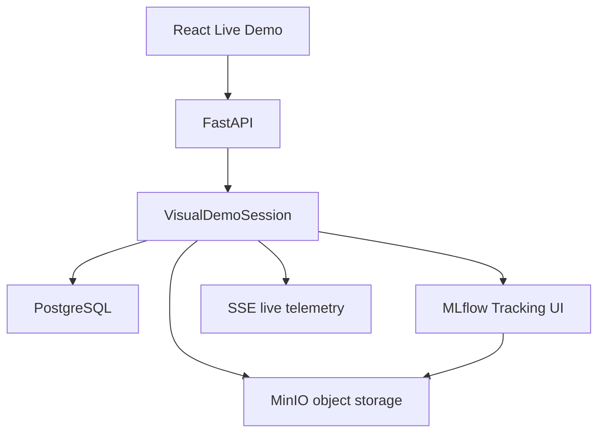

# Runtime Stack

This document explains why PostgreSQL, MLflow and MinIO exist in ACN and how they now participate
in the visible adaptive-learning workflow.

The stack remains local-first and Docker Compose based. No cloud service, Kubernetes, Kafka,
Celery, Ray or distributed scheduler is required.

## Components



## Why PostgreSQL Exists

PostgreSQL is the durable system of record for ACN runtime state:

- training branches;
- commits;
- stable checkpoint records;
- experiment records;
- controller decisions;
- rollback events.

The visual demo writes version metadata to PostgreSQL when `ACN_RUNTIME_STACK_ENABLED=true`.
Dashboard viewers can then see that checkpoint history is not only an in-memory animation; it is
persisted as ACN version state.

## Why MLflow Exists

MLflow is the experiment tracking surface:

- run ID;
- parameters;
- metric curves;
- checkpoint artifacts;
- rollback notes;
- best run comparison over repeated demo runs.

Open the MLflow UI:

```text
http://localhost:5000
```

Look for the `ACN Visual Adaptive Demo` experiment. Each `Live Demo` run logs metrics such as
`train_loss`, `validation_loss`, `accuracy` and `learning_rate`.

## Why MinIO Exists

MinIO stores binary model artifacts:

- checkpoint payloads;
- inference-ready model states;
- MLflow artifact files.

ACN commits reference MinIO URIs such as:

```text
s3://acn-artifacts/checkpoints/visual-demo/cmt_epoch_03.pt
```

This links:

```text
ACN commit -> stable checkpoint record -> MinIO checkpoint object -> MLflow run artifact
```

## Startup

Start the full local stack:

```bash
cp .env.example .env
make compose-up
```

The Compose stack starts:

- FastAPI;
- React frontend;
- PostgreSQL;
- Redis;
- MinIO;
- MLflow.

Open:

- Dashboard: <http://localhost:5173>
- API health: <http://localhost:8000/health>
- Runtime health: <http://localhost:8000/api/v1/runtime/health>
- MLflow: <http://localhost:5000>
- MinIO console: <http://localhost:9001>

MinIO default credentials:

```text
minioadmin / minioadmin
```

## Demo Flow

1. Open the dashboard.
2. Choose `Live Demo`.
3. Press `Start`.
4. Watch live training curves and validation predictions.
5. Watch checkpoint records appear with MinIO artifact URIs.
6. Open MLflow and inspect the run metrics.
7. In the dashboard, inspect the artifact browser panel.
8. Trigger or wait for degradation and rollback.
9. Confirm rollback events are visible in the event feed and logged to the runtime stack.

## Runtime Validation

The API endpoint:

```text
GET /api/v1/runtime/health
```

reports:

- PostgreSQL connected;
- MLflow connected;
- MinIO connected;
- artifact storage writable.

The `Live Demo` screen also shows runtime stack status.

## Local Fallback

If `ACN_RUNTIME_STACK_ENABLED=false`, the visual demo still works in memory. This is useful for
frontend-only iteration, but it does not prove infrastructure integration.

For leadership or review demos, use Docker Compose with:

```text
ACN_RUNTIME_STACK_ENABLED=true
```

This is already present in `.env.example`.
