# ACN Architecture and Implementation Audit

Date: 2026-05-18  
Scope: current repository state under `/mnt/d/DevDrive/localzet/ACN`  
Audience: external architectural review by another AI system

## Executive Summary

Adaptive Core Network (ACN) is currently a modular-monolith ML experimentation framework with a thin FastAPI API, a placeholder worker process, a typed React dashboard, a PyTorch trainer core, Git-like training versioning, a Citadel safety layer, rule-based and neural adaptive controllers, continual-learning utilities, orchestration primitives, and deterministic demo/research pipelines.

The architecture is directionally sound: core ML modules do not depend on the API or UI, orchestration coordinates rather than owns training, Citadel centralizes safety validation, and versioning is behind a repository interface. The implementation is still early. Several flows are production-shaped but not production-complete: dashboard endpoints return an empty contract snapshot, the worker has no queue processing, E2E and research pipelines use deterministic synthetic data rather than real Fashion-MNIST/CIFAR-10-C training, Redis is provisioned but not used, and MLflow/MinIO are infrastructure-ready but not wired into the trainer/orchestrator.

The codebase is typed, small-module oriented, and has meaningful tests. Current coverage from `reports/coverage/coverage.xml` is approximately 90.55% line coverage and 70.75% branch coverage. This is good for the implemented surface, but it overstates system readiness because many integration paths are lightweight simulations.

## 1. Repository Structure

Generated dependency/cache directories are intentionally omitted from this tree: `.git`, `.venv`, `apps/web/node_modules`, `__pycache__`, `.mypy_cache`, `.ruff_cache`, `.pytest_cache`, downloaded dataset binaries, and coverage HTML internals. These are present in the workspace but not architecture-bearing.

```text
.
├── AGENTS.md
├── Makefile
├── README.md
├── alembic.ini
├── docker-compose.yml
├── pyproject.toml
├── apps
│   ├── api
│   │   ├── README.md
│   │   └── src/acn_api
│   │       ├── __init__.py
│   │       ├── dashboard.py
│   │       └── main.py
│   ├── web
│   │   ├── index.html
│   │   ├── package.json
│   │   ├── package-lock.json
│   │   ├── tsconfig.json
│   │   ├── vite.config.ts
│   │   └── src
│   │       ├── App.tsx
│   │       ├── config.ts
│   │       ├── main.tsx
│   │       ├── styles.css
│   │       ├── api
│   │       │   ├── dashboardApi.ts
│   │       │   └── liveUpdates.ts
│   │       ├── components
│   │       │   ├── EmptyState.tsx
│   │       │   └── Panel.tsx
│   │       ├── demo
│   │       │   └── demoPreset.ts
│   │       ├── hooks
│   │       │   ├── useDashboardData.ts
│   │       │   └── useDemoPlayback.ts
│   │       ├── types
│   │       │   └── dashboard.ts
│   │       └── views
│   │           ├── BranchGraphView.tsx
│   │           ├── CommitGraphView.tsx
│   │           ├── ControllerDecisionsView.tsx
│   │           ├── DemoPresentationView.tsx
│   │           ├── ExperimentInspectorView.tsx
│   │           ├── LiveLogsView.tsx
│   │           ├── MetricsTimelineView.tsx
│   │           ├── OverrideConsole.tsx
│   │           └── RollbackHistoryView.tsx
│   └── worker
│       ├── README.md
│       └── src/acn_worker
│           ├── __init__.py
│           └── main.py
├── configs
│   ├── continual
│   │   ├── cifar10_domain_shift_example.json
│   │   ├── fashion_mnist_demo.json
│   │   └── split_cifar100_example.json
│   ├── demo
│   │   └── acn_demo_mode.json
│   └── experiments
│       ├── acn_e2e_reproducible.json
│       └── research_benchmark.json
├── docs
│   ├── 01_product_vision.md
│   ├── 02_system_architecture.md
│   ├── 03_ml_architecture.md
│   ├── 04_roadmap.md
│   ├── 05_lab_protocols.md
│   ├── 06_demo_protocols.md
│   ├── 07_datasets.md
│   ├── 08_hardware_strategy.md
│   ├── 09_repository_structure.md
│   ├── 10_codex_prompts.md
│   ├── 11_future_video_support.md
│   ├── 12_final_positioning.md
│   ├── 13_orchestration.md
│   ├── 14_dashboard_frontend.md
│   ├── 15_architecture_audit.md
│   ├── 16_e2e_experiment_pipeline.md
│   ├── 17_research_evaluation.md
│   ├── 18_demo_mode.md
│   ├── 19_testing_architecture.md
│   ├── ARCHITECTURE_AUDIT.md
│   └── README.md
├── infra
│   ├── db/alembic
│   │   ├── env.py
│   │   ├── script.py.mako
│   │   └── versions
│   │       ├── 20260516_0001_create_training_version_store.py
│   │       ├── 20260516_0002_create_citadel_audit_logs.py
│   │       └── 20260517_0003_create_experiment_state.py
│   └── docker
│       ├── mlflow.Dockerfile
│       ├── python.Dockerfile
│       └── web.Dockerfile
├── packages/acn
│   ├── README.md
│   └── src/acn
│       ├── __init__.py
│       ├── citadel
│       │   ├── __init__.py
│       │   ├── audit.py
│       │   ├── domain.py
│       │   ├── models.py
│       │   ├── policy.py
│       │   └── repository.py
│       ├── config
│       │   ├── __init__.py
│       │   ├── logging.py
│       │   └── settings.py
│       ├── continual
│       │   ├── __init__.py
│       │   ├── dataset.py
│       │   ├── datasource.py
│       │   ├── evaluation.py
│       │   ├── replay.py
│       │   ├── scenario.py
│       │   ├── stage.py
│       │   ├── stream.py
│       │   └── torchvision_sources.py
│       ├── controller
│       │   ├── __init__.py
│       │   ├── controller.py
│       │   ├── domain.py
│       │   ├── example_policies.py
│       │   ├── neural.py
│       │   └── policies.py
│       ├── domain
│       │   └── __init__.py
│       ├── experiments
│       │   ├── __init__.py
│       │   ├── e2e.py
│       │   └── research.py
│       ├── infrastructure
│       │   └── __init__.py
│       ├── orchestration
│       │   ├── __init__.py
│       │   ├── decision.py
│       │   ├── domain.py
│       │   ├── manager.py
│       │   ├── models.py
│       │   ├── pipeline.py
│       │   ├── repository.py
│       │   ├── rollback.py
│       │   ├── session.py
│       │   └── stage_transition.py
│       ├── services
│       │   └── __init__.py
│       ├── training
│       │   ├── __init__.py
│       │   ├── checkpointing.py
│       │   ├── config.py
│       │   ├── freezing.py
│       │   ├── optimizers.py
│       │   ├── schedulers.py
│       │   └── trainer.py
│       └── versioning
│           ├── __init__.py
│           ├── domain.py
│           ├── exceptions.py
│           ├── models.py
│           └── repository.py
├── reports/coverage
│   ├── coverage.xml
│   └── html
├── scripts
│   ├── citadel/simulate_citadel.py
│   ├── continual/fashion_mnist_demo_scenario.py
│   ├── controller/compare_controllers.py
│   ├── controller/evaluate_neural_policy.py
│   ├── controller/simulate_rule_based_controller.py
│   ├── demo/generate_demo_assets.py
│   ├── experiments/run_e2e_experiment.py
│   ├── experiments/run_research_benchmark.py
│   ├── orchestration/example_experiment_lifecycle.py
│   └── train_fashion_mnist.py
└── tests
    ├── api
    ├── citadel
    ├── continual
    ├── controller
    ├── demo
    ├── experiments
    ├── integration
    ├── orchestration
    ├── training
    ├── unit
    ├── versioning
    └── worker
```

### Module Responsibilities

| Area | Primary files | Responsibility |
| --- | --- | --- |
| API | `apps/api/src/acn_api/main.py`, `apps/api/src/acn_api/dashboard.py` | FastAPI app factory, health check, dashboard contract, SSE/WebSocket bootstrap. |
| Worker | `apps/worker/src/acn_worker/main.py` | Worker process entrypoint and logging bootstrap. No queue loop yet. |
| Config | `packages/acn/src/acn/config/settings.py`, `logging.py` | Pydantic settings, environment variable mapping, shared logging setup. |
| Training | `packages/acn/src/acn/training/*` | PyTorch trainer, checkpointing, optimizer/scheduler factories, layer freeze helpers. |
| Versioning | `packages/acn/src/acn/versioning/*` | Git-like branches, commits, stable checkpoints, SQLAlchemy repository and models. |
| Citadel | `packages/acn/src/acn/citadel/*` | Critical-action validation, audit logging, checkpoint immutability policy. |
| Controller | `packages/acn/src/acn/controller/*` | Rule-based adaptive policy, neural policy network, controller domain records. |
| Continual learning | `packages/acn/src/acn/continual/*` | Dataset abstractions, stages, replay buffer, forgetting evaluator, stream abstractions. |
| Orchestration | `packages/acn/src/acn/orchestration/*` | Experiment lifecycle, stage transitions, commit/branch/rollback coordination. |
| Experiments | `packages/acn/src/acn/experiments/*` | Deterministic E2E pipeline and research benchmark utilities. |
| Frontend | `apps/web/src/*` | React dashboard, graph/timeline/log/override views, live-update client, demo mode. |
| Infra | `docker-compose.yml`, `infra/docker/*`, `infra/db/alembic/*` | Local services, Docker images, Alembic migrations. |

### Dependency Boundaries

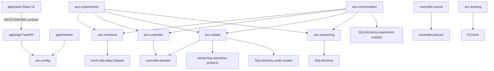

Boundary assessment:
- `acn.training` has no dependency on API, UI, controller, Citadel, versioning, or orchestration. This is correct.
- `acn.controller` has no dependency on trainer, API, UI, database, or orchestration. This is correct.
- `acn.orchestration` depends on multiple domains and acts as a coordinator. This is correct for a modular monolith.
- `acn.citadel` depends on controller action types and versioning repository contracts. This coupling is acceptable because Citadel validates action safety against version history.
- `apps/web` depends only on HTTP/event contracts, not backend packages. This is correct.
- Empty namespaces `acn.domain`, `acn.infrastructure`, and `acn.services` currently have no ownership and are architectural placeholders.

## 2. System Architecture

### High-Level Architecture

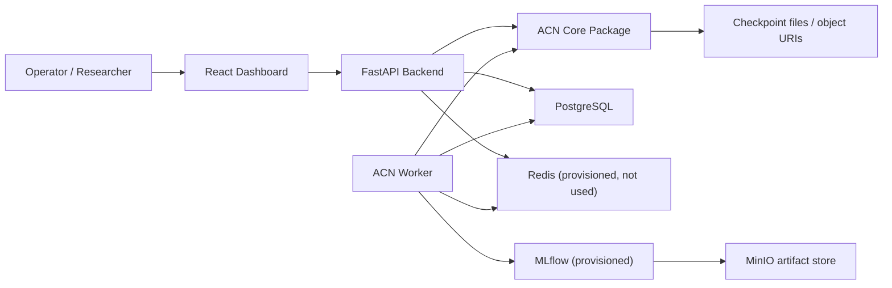

The intended system is a modular monolith plus worker:
- API exposes health/dashboard/control surfaces.
- Worker should eventually execute training/orchestration jobs.
- Core package owns domain logic.
- PostgreSQL stores versioning, audit logs, and experiment state.
- Redis is intended for queue/event coordination but is not yet used in code.
- MLflow and MinIO are present in Docker Compose but not wired into training code.

### Service and Module Interactions

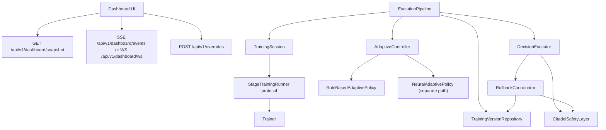

### Data Flow

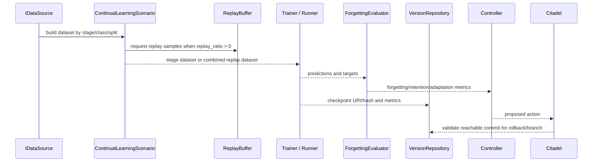

### Training Flow

1. Dataset or DataLoader is created outside `Trainer`.
2. Optimizer is built with `build_optimizer` or `build_optimizer_for_parameters`.
3. Scheduler is optionally built with `build_scheduler`.
4. `Trainer.fit` runs `train_epoch`, optional `validate`, scheduler step, logging, and checkpoint save.
5. `CheckpointManager.save` writes model, optimizer, scheduler, AMP scaler, and `CheckpointState`.
6. `CheckpointManager.load` restores state.

Current limitation: the trainer has no MLflow logging, no gradient norm reporting to controller, no DDP, no object storage checkpoint backend, and no callback system.

### Orchestration Flow

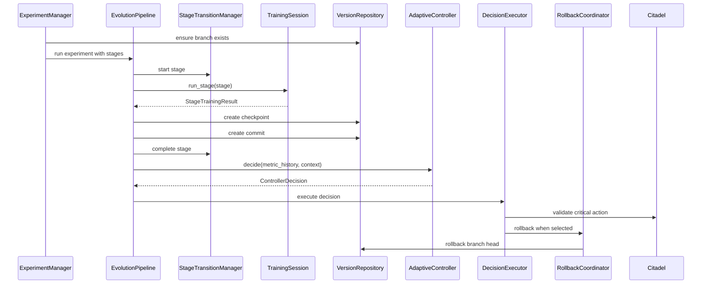

## 3. Core Components

### Trainer

Files:
- `packages/acn/src/acn/training/trainer.py`
- `packages/acn/src/acn/training/config.py`
- `packages/acn/src/acn/training/checkpointing.py`
- `packages/acn/src/acn/training/optimizers.py`
- `packages/acn/src/acn/training/schedulers.py`
- `packages/acn/src/acn/training/freezing.py`

Purpose: reusable PyTorch training core decoupled from API/UI/orchestration.

Responsibilities:
- Device resolution with CUDA preference.
- Mixed precision via `torch.autocast` and `torch.GradScaler` when CUDA is active.
- Train/validation loops.
- Accuracy calculation for classification logits.
- Checkpoint save/load.
- Optimizer and scheduler construction.
- Freeze/unfreeze layers by parameter-name prefixes.

Public interfaces:
- `Trainer.fit`
- `Trainer.train_epoch`
- `Trainer.validate`
- `Trainer.load_checkpoint`
- `CheckpointManager.save/load`
- `OptimizerConfig`, `SchedulerConfig`, `TrainerConfig`
- `build_optimizer`, `build_scheduler`
- `freeze_layers`, `unfreeze_layers`

Internal dependencies:
- PyTorch, `torch.utils.data.DataLoader`
- Local config/checkpoint modules.

Architectural decisions:
- Trainer accepts already-created model, criterion, optimizer, scheduler. This keeps construction policy outside training.
- Checkpoint payload stores optimizer/scheduler/scaler state for resumability.
- No API or DB dependencies by design.

Known limitations:
- No callback/event interface.
- No MLflow integration despite MLflow being in infrastructure.
- No gradient norm metric emitted, although neural controller expects `gradient_norm` as an input concept.
- Scheduler stepping is epoch-level only and does not support per-step schedulers.
- Checkpoint storage is filesystem-only; stable checkpoint metadata stores URI/hash separately in versioning.
- `torch.load` in `CheckpointManager.load` does not use `weights_only=True` because it restores optimizer/scheduler/scaler payloads; this should be threat-modeled if loading untrusted checkpoints.

### Evaluator

Files:
- `packages/acn/src/acn/continual/evaluation.py`

Purpose: continual-learning evaluation for retention, adaptation, forgetting, and latency.

Responsibilities:
- Evaluate model predictions from a DataLoader.
- Compute per-class accuracy.
- Track best historical class accuracy.
- Compute old-class retention, new-class adaptation, forgetting score, and adaptation latency.

Public interfaces:
- `ForgettingEvaluator.evaluate_predictions`
- `ContinualEvaluationPipeline.evaluate_model`
- `ContinualMetrics`

Internal dependencies:
- PyTorch inference.
- `parse_image_sample` from `acn.continual.dataset`.

Architectural decisions:
- Evaluator is stateful because forgetting depends on previous best class accuracy.
- Model inference is optional; direct prediction evaluation is supported for deterministic tests/simulations.

Known limitations:
- No confidence calibration, macro/micro averaging mode selection, or class imbalance handling beyond per-class mean.
- No persistence of evaluator state.
- No streaming evaluation window.

### Version Store

Files:
- `packages/acn/src/acn/versioning/domain.py`
- `packages/acn/src/acn/versioning/models.py`
- `packages/acn/src/acn/versioning/repository.py`
- `packages/acn/src/acn/versioning/exceptions.py`
- `infra/db/alembic/versions/20260516_0001_create_training_version_store.py`

Purpose: Git-like training evolution state: immutable stable checkpoints, commits, branches, and commit graph.

Responsibilities:
- Register stable checkpoint records with unique URI and content hash.
- Create branches with optional base commit.
- Create commits with parent-child relationships.
- Move branch heads via rollback only to reachable commits.
- Build graph nodes/edges for dashboard visualization.

Public interfaces:
- `TrainingVersionRepository` protocol.
- `SqlAlchemyTrainingVersionRepository`.
- `create_checkpoint`, `create_branch`, `create_commit`, `get_branch`, `get_commit`, `list_branch_history`, `rollback_branch`, `get_commit_graph`.

Internal dependencies:
- SQLAlchemy ORM models.
- PostgreSQL JSONB variant via SQLAlchemy JSON type.

Architectural decisions:
- Repository pattern isolates SQLAlchemy from orchestration.
- Checkpoints are modeled as immutable stable records.
- Commit graph supports parent-child relationships; branch history follows the current branch head backward through parents.

Known limitations:
- No multi-parent merge commits.
- No branch deletion, tagging, or promotion workflows.
- No explicit branch status table field.
- Reachability checks load all commits into memory.
- No database-level constraint tying experiment state commit IDs to training commits.
- Immutable checkpoint protection uses SQLAlchemy events; direct SQL can still mutate rows.

### Adaptive Controller

Files:
- `packages/acn/src/acn/controller/domain.py`
- `packages/acn/src/acn/controller/controller.py`
- `packages/acn/src/acn/controller/policies.py`
- `packages/acn/src/acn/controller/example_policies.py`

Purpose: explainable rule-based policy for adaptive training actions.

Responsibilities:
- Analyze training metric sequences.
- Detect degradation, plateau, overfitting, underfitting, and stable improvement.
- Choose actions: rollback, LR decrease/increase, freeze/unfreeze, branch, continue.
- Log decisions.

Public interfaces:
- `AdaptiveController.decide`
- `RuleBasedAdaptivePolicy.analyze/decide`
- `RuleBasedPolicyConfig`
- `MetricPoint`, `TrainingContext`, `ControllerDecision`, `ControllerSignals`, `AdaptiveAction`

Internal dependencies:
- Pure Python/dataclasses.

Architectural decisions:
- The controller emits decisions but does not execute them.
- Decisions include reasons and parameters for explainability and downstream validation.

Known limitations:
- Metric inputs are narrow: train/validation loss/accuracy and LR only.
- No explicit use of forgetting score in rule-based domain model.
- No persisted decision log model yet.
- Thresholds are static and globally configured.

### Neural Controller

Files:
- `packages/acn/src/acn/controller/neural.py`
- `scripts/controller/evaluate_neural_policy.py`
- `scripts/controller/compare_controllers.py`

Purpose: neural policy network for adaptive decision selection with fallback to rule-based policy.

Responsibilities:
- Convert metrics/context/state into 10 scalar features.
- Predict one of seven adaptive actions.
- Train offline from labeled examples.
- Evaluate labeled policy examples.
- Fall back when metrics are absent or confidence is below threshold.

Public interfaces:
- `PolicyNetwork`
- `NeuralAdaptivePolicy.decide/save/load`
- `train_policy_offline`
- `evaluate_policy_examples`
- `build_policy_features`
- `NeuralControllerState`, `NeuralPolicyConfig`, `PolicyTrainingExample`

Internal dependencies:
- PyTorch.
- Rule-based policy fallback.

Architectural decisions:
- Neural policy is intentionally small (`hidden_size=32` default) and RTX 3060-friendly.
- Fallback is built in to reduce unsafe low-confidence decisions.

Known limitations:
- Offline examples are synthetic/test-scale; no production dataset for policy learning exists.
- Feature normalization is absent.
- Branch history is reduced to two scalar fields; no graph neural or sequence model.
- Explainability is probability-based only, not attribution-based.
- Neural policy is not integrated into `AdaptiveController`; it is a parallel policy class.

### Orchestrator

Files:
- `packages/acn/src/acn/orchestration/manager.py`
- `packages/acn/src/acn/orchestration/pipeline.py`
- `packages/acn/src/acn/orchestration/session.py`
- `packages/acn/src/acn/orchestration/stage_transition.py`
- `packages/acn/src/acn/orchestration/decision.py`
- `packages/acn/src/acn/orchestration/rollback.py`
- `packages/acn/src/acn/orchestration/repository.py`
- `packages/acn/src/acn/orchestration/models.py`
- `infra/db/alembic/versions/20260517_0003_create_experiment_state.py`

Purpose: coordinate training stages, version commits, controller decisions, branch creation, rollback, and experiment state.

Responsibilities:
- Create/start/complete/fail experiments.
- Start/complete/fail stage executions.
- Run synchronous training stage runner.
- Commit stage results to version store.
- Execute controller decisions via Citadel and rollback coordinator.

Public interfaces:
- `ExperimentManager`
- `EvolutionPipeline.run`
- `TrainingSession`
- `StageTransitionManager`
- `DecisionExecutor.execute`
- `RollbackCoordinator.rollback`
- `ExperimentStateRepository`, `SqlAlchemyExperimentStateRepository`, `InMemoryExperimentStateRepository`

Internal dependencies:
- Continual stage records.
- Controller decisions.
- Citadel safety layer.
- Versioning repository.
- SQLAlchemy experiment models.

Architectural decisions:
- Training is abstracted behind `StageTrainingRunner` protocol.
- Orchestration is synchronous at the stage-running boundary.
- Decision execution is separated from decision generation.

Known limitations:
- SQLAlchemy repository calls are synchronous and align with synchronous orchestration.
- `best_commit_id` currently defaults to first commit and does not compare metric quality in `EvolutionPipeline`.
- Decision results for LR/freeze/unfreeze are validated but not applied to a live trainer.
- No durable event bus or worker job state.
- No retry/cancellation semantics beyond status update.

### Citadel Layer

Files:
- `packages/acn/src/acn/citadel/domain.py`
- `packages/acn/src/acn/citadel/policy.py`
- `packages/acn/src/acn/citadel/audit.py`
- `packages/acn/src/acn/citadel/repository.py`
- `packages/acn/src/acn/citadel/models.py`
- `infra/db/alembic/versions/20260516_0002_create_citadel_audit_logs.py`

Purpose: safety gate for critical training evolution actions.

Responsibilities:
- Validate rollback target reachability.
- Validate learning-rate bounds.
- Validate layer selector presence.
- Validate experimental branch source reachability.
- Deny stable checkpoint overwrite.
- Record audit decisions.
- Support override approvals for selected actions.

Public interfaces:
- `CitadelSafetyLayer.validate_action`
- `CitadelSafetyLayer.validate_checkpoint_registration`
- `CitadelPolicyConfig`
- `CitadelActionRequest`, `CitadelValidationResult`, `OverrideApproval`
- `AuditLogRepository`, `SqlAlchemyAuditLogRepository`, `InMemoryAuditLogRepository`

Internal dependencies:
- Controller action enum.
- Version repository protocol.
- SQLAlchemy audit model.

Architectural decisions:
- Critical actions are listed explicitly in policy config.
- Overrides are represented as structured approvals and audited.
- Rollback validation consults branch history.

Known limitations:
- Citadel is not enforced by database triggers; it relies on application routing.
- API override endpoint currently accepts payloads but does not persist or route to Citadel.
- No actor authentication/authorization.
- No tamper-proof audit storage.

### Continual Learning Pipeline

Files:
- `packages/acn/src/acn/continual/datasource.py`
- `packages/acn/src/acn/continual/dataset.py`
- `packages/acn/src/acn/continual/stage.py`
- `packages/acn/src/acn/continual/scenario.py`
- `packages/acn/src/acn/continual/evaluation.py`
- `packages/acn/src/acn/continual/torchvision_sources.py`
- `packages/acn/src/acn/continual/stream.py`

Purpose: stage-based dataset abstraction for incremental image classification and future streams.

Responsibilities:
- Represent dataset stages and introduced classes.
- Build class-filtered datasets.
- Apply synthetic domain shifts.
- Combine current-stage data with replay samples.
- Support torchvision Fashion-MNIST/CIFAR-10/CIFAR-100 source factories.
- Provide async video/camera stream abstractions and synchronous Dataset snapshots.

Public interfaces:
- `IDataSource`
- `ImageDatasetSource`
- `SyntheticDomainShiftSource`
- `ContinualLearningScenario`
- `DatasetStageConfig`, `DatasetStage`, `DatasetSplit`
- `VideoFileSource`, `CameraStreamSource`, `FrameSampler`, `TemporalBuffer`, `StreamMetadata`

Internal dependencies:
- PyTorch Dataset/Tensor.
- Optional torchvision for source factories.

Architectural decisions:
- Scenario construction computes introduced classes from stage order.
- Stream ingestion is separate from trainer; trainer sees Dataset snapshots only.
- Synthetic domain shifts are tensor transforms, not dataset-specific implementations.

Known limitations:
- CIFAR-10-C is represented by synthetic corruption, not the real CIFAR-10-C benchmark files.
- Dataset downloads are invoked by torchvision factories and are not abstracted behind a cache policy.
- Stream sources require injected `frame_reader`; no OpenCV/PyAV integration.
- No stream labeling strategy beyond optional/default target.

### Replay Buffer

Files:
- `packages/acn/src/acn/continual/replay.py`

Purpose: bounded sample memory for continual learning rehearsal.

Responsibilities:
- Add full datasets into replay memory.
- Optionally balanced-sample per class.
- Enforce global capacity with seeded random sampling.
- Expose immutable-ish replay dataset snapshots that clone tensors on read.

Public interfaces:
- `ReplayBuffer`
- `ReplayBufferConfig`
- `ReplayDataset`

Internal dependencies:
- `parse_image_sample`
- Python `random.Random`
- PyTorch Dataset.

Architectural decisions:
- Buffer stores detached CPU clones for GPU memory safety.
- Seeded RNG makes tests and demos reproducible.

Known limitations:
- In-memory only.
- Reservoir sampling is not implemented; capacity trimming samples from all current memory after append.
- No persistence, eviction metrics, or class-aware long-term balancing after capacity trim.

### Dashboard Backend

Files:
- `apps/api/src/acn_api/main.py`
- `apps/api/src/acn_api/dashboard.py`

Purpose: FastAPI API shell and frontend integration contract.

Responsibilities:
- Health endpoint.
- Dashboard snapshot endpoint.
- SSE and WebSocket live-update bootstrap.
- Override submission contract.

Public interfaces:
- `create_app(settings)`
- `GET /health`
- `GET /api/v1/dashboard/snapshot`
- `GET /api/v1/dashboard/events`
- `WS /api/v1/dashboard/ws`
- `POST /api/v1/overrides`

Internal dependencies:
- FastAPI, Starlette `StreamingResponse`, Pydantic.
- Shared settings/logging.

Architectural decisions:
- Router returns frontend-compatible camelCase payloads.
- Override request accepts snake_case and camelCase aliases.

Known limitations:
- Snapshot returns empty arrays and one bootstrap log. It is contract-only, not connected to repositories.
- SSE emits one snapshot and does not remain attached to an event source.
- WebSocket sends one snapshot and closes.
- No authentication, authorization, rate limiting, CORS configuration, or DB session management.

### Frontend

Files:
- `apps/web/src/App.tsx`
- `apps/web/src/types/dashboard.ts`
- `apps/web/src/api/dashboardApi.ts`
- `apps/web/src/api/liveUpdates.ts`
- `apps/web/src/hooks/useDashboardData.ts`
- `apps/web/src/views/*`
- `apps/web/src/demo/demoPreset.ts`
- `apps/web/src/hooks/useDemoPlayback.ts`

Purpose: typed React dashboard for experiment state, graph visualization, metrics, decisions, rollback history, logs, override console, and demo mode.

Responsibilities:
- Fetch snapshot from backend.
- Subscribe to SSE or WebSocket updates.
- Render commit/branch graphs with React Flow.
- Render metrics with Recharts.
- Render controller decision and rollback audit views.
- Submit human override requests.
- Provide deterministic presentation mode.

Public interfaces:
- `DashboardSnapshot` and related TypeScript contract types.
- `fetchDashboardSnapshot`
- `connectLiveUpdates`
- `useDashboardData`

Internal dependencies:
- React 19, Vite, Tailwind CSS 4, React Flow, Recharts, lucide-react.

Architectural decisions:
- Demo mode is explicit via `VITE_DEMO_MODE=true`.
- Live events are applied incrementally to snapshot state.
- Empty states are rendered when backend has no data.

Known limitations:
- Most useful visuals require backend data that is not yet wired.
- Demo mode uses static preset data.
- No frontend tests are present.
- No authentication state.

## 4. Database Design

### Schema Overview

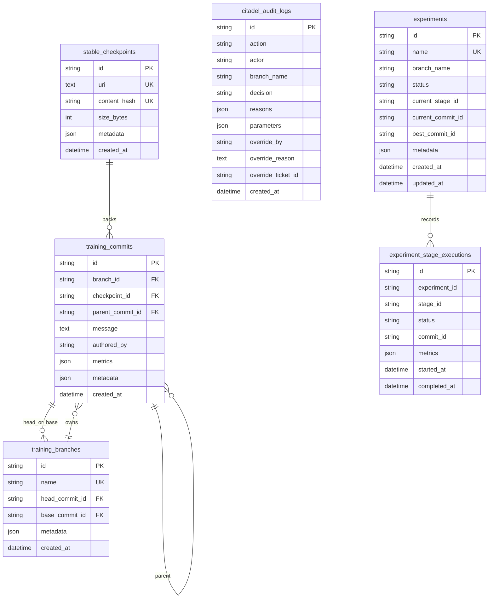

### Entity Relationships

- `training_commits.branch_id -> training_branches.id` with cascade delete.
- `training_commits.checkpoint_id -> stable_checkpoints.id` with restrict delete.
- `training_commits.parent_commit_id -> training_commits.id` with restrict delete.
- `training_branches.head_commit_id -> training_commits.id` with set null.
- `training_branches.base_commit_id -> training_commits.id` with set null.
- `experiments` and `experiment_stage_executions` currently store commit/branch references as strings without foreign keys.
- `citadel_audit_logs.branch_name` is a string, not a foreign key.

### Migration Strategy

Alembic migrations:
- `20260516_0001_create_training_version_store.py`: versioning tables.
- `20260516_0002_create_citadel_audit_logs.py`: audit logs.
- `20260517_0003_create_experiment_state.py`: experiment state.

Observations:
- Migrations use PostgreSQL JSONB directly. ORM models use JSON with PostgreSQL JSONB variants, which supports SQLite tests.
- No migration for dashboard decision logs exists.
- No migration enforces experiment-to-commit referential integrity.
- No seed/bootstrap migration exists for branches.

## 5. API Design

### REST Endpoints

| Method | Path | File | Current behavior |
| --- | --- | --- | --- |
| GET | `/health` | `apps/api/src/acn_api/main.py` | Returns `{"status": "ok", "environment": settings.env}`. |
| GET | `/api/v1/dashboard/snapshot` | `apps/api/src/acn_api/dashboard.py` | Returns empty dashboard contract plus bootstrap log. |
| POST | `/api/v1/overrides` | `apps/api/src/acn_api/dashboard.py` | Accepts override payload and returns accepted response. Does not persist or execute. |

### WebSocket/SSE Architecture

| Transport | Path | Current behavior |
| --- | --- | --- |
| SSE | `/api/v1/dashboard/events` | Streams a single `snapshot` event then completes. |
| WebSocket | `/api/v1/dashboard/ws` | Accepts, sends a single `snapshot` event, closes. |

Intended future direction:
- Persistent event stream from worker/orchestrator events.
- Dashboard state generated from repositories plus live event fanout.
- Redis pub/sub or streams could back live delivery, but this is not implemented.

### Authentication Approach

There is no authentication or authorization implementation. This is a major production gap because override actions, rollback, branch creation, and checkpoint protection require identity and permission boundaries.

Required future work:
- API authentication middleware.
- Operator identity propagation into Citadel audit logs.
- Role-based permissions for overrides and critical actions.
- CSRF/CORS strategy for dashboard deployment.

## 6. ML Architecture

### Model Architecture

Implemented:
- Generic PyTorch `nn.Module` trainer.
- Neural controller `PolicyNetwork`: MLP with input size 10, two hidden layers, ReLU, dropout, output size 7.

Documented but not fully implemented:
- `docs/03_ml_architecture.md` mentions ResNet18 as target model.
- `scripts/train_fashion_mnist.py` provides an example training script, but the core framework does not standardize a model registry.

### Training Pipeline

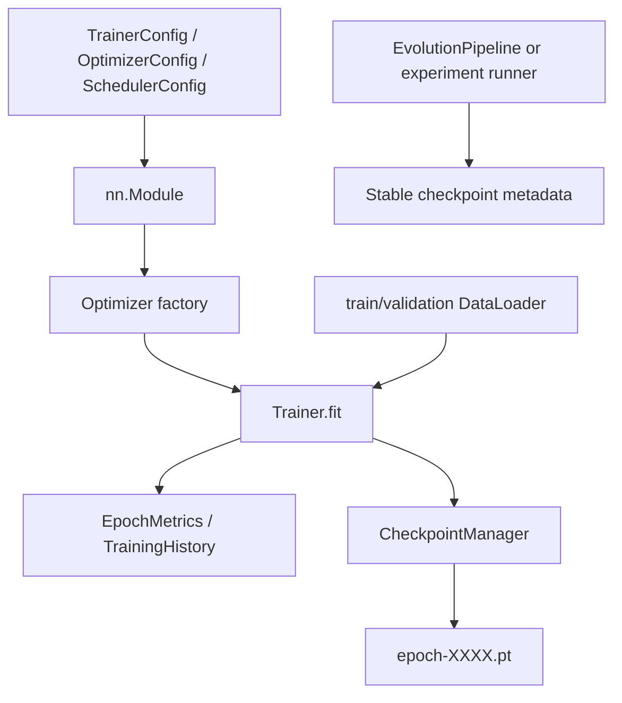

### Continual Learning Flow

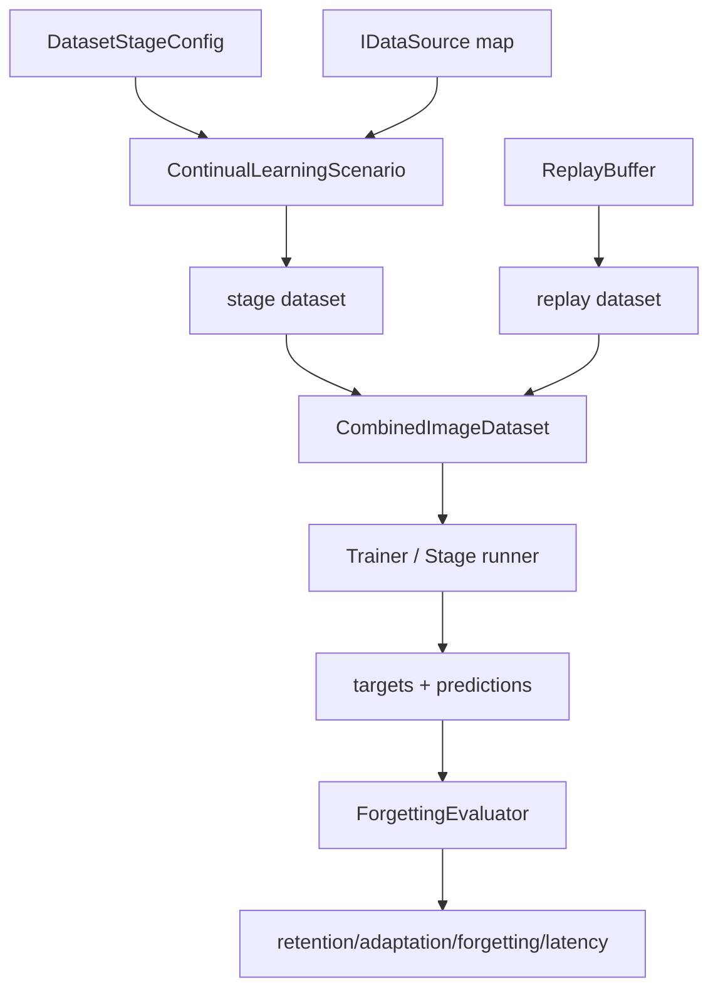

### Rollback Strategy

Implemented:
- Version repository moves branch head to a reachable target commit.
- Citadel validates target reachability before rollback.
- Rollback coordinator is the sole rollback executor in orchestration.
- E2E simulation creates recovery branch after rollback.

Limitations:
- No model weights are automatically restored by rollback orchestration.
- No checkpoint artifact fetch/load path is wired.
- No rollback dry-run or rollback impact report.
- No stable checkpoint promotion policy beyond immutable record creation.

### Branching Strategy

Implemented:
- Branches have name, base commit, head commit.
- Experimental branch creation is driven by decision executor.
- Branch graph can be generated from stored branch/commit references.

Limitations:
- Branch names are deterministic from source commit prefix and can collide.
- No merge, compare, promotion, or branch retirement workflow.
- No dashboard-backed branch history endpoint yet.

### Replay Strategy

Implemented:
- Replay buffer stores CPU clones.
- Combined stage+replay dataset supports configurable `replay_ratio`.
- Class-balanced sample ingestion is supported.

Limitations:
- Replay is in-memory only.
- Sampling is basic; no herding, priority, uncertainty, diversity, or reservoir algorithm.
- Replay dataset can grow by full stage ingestion before capacity trim, which may be memory-heavy for large datasets.

## 7. Adaptive Logic

### Controller Decision Flow

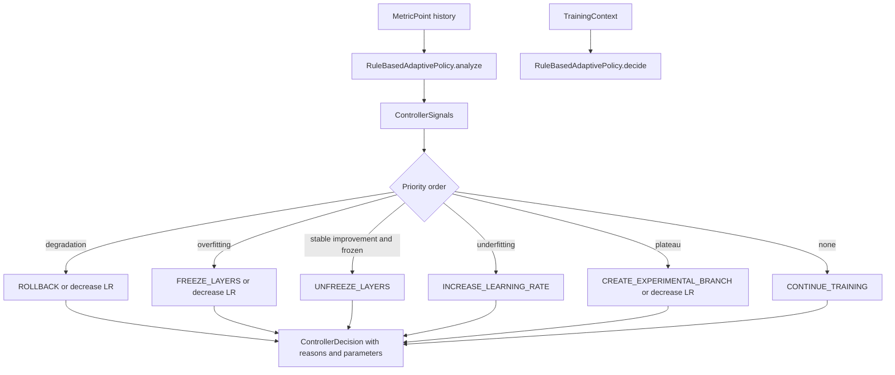

### Policy Engine Logic

Rule-based signals:
- Degradation: recent validation losses exceed previous best by configured delta for configured patience.
- Plateau: validation loss range within configured window is below threshold.
- Overfitting: generalization gap and validation loss increase exceed thresholds.
- Underfitting: low train accuracy after minimum epochs.
- Stable improvement: validation loss decreases consistently over a window.

Neural logic:
- Feature vector: train loss, validation loss, forgetting score, rollback count, adaptation latency, gradient norm, learning rate, branch history length, branch divergence depth, frozen flag.
- Output actions: continue, rollback, decrease LR, increase LR, freeze, unfreeze, create branch.
- Confidence threshold fallback to rule-based policy.

### Rollback Triggers

Rule-based rollback occurs when:
- Degradation is detected.
- `RuleBasedPolicyConfig.degradation_action == AdaptiveAction.ROLLBACK`.
- `TrainingContext.best_commit_id` is available as target.
- Citadel confirms target is reachable.

Risk: when `best_commit_id` is `None`, the decision can carry `target_commit_id=None`; downstream execution requires a non-empty string and can raise. Citadel can also deny missing target. This is acceptable in tests but needs a cleaner no-target decision path.

### Branch Creation Logic

Branch creation occurs when:
- Plateau is detected and `plateau_action == CREATE_EXPERIMENTAL_BRANCH`.
- Decision includes `source_commit_id=current_commit_id`.
- Citadel validates source commit reachability.
- `DecisionExecutor` creates branch name `{branch_name}/exp-{source_commit_id[:8]}`.

Risk: branch naming can collide if repeated decisions occur from the same source commit.

## 8. Infrastructure

### Docker Architecture

`docker-compose.yml` defines:
- `api`: Python image, runs Uvicorn factory app on port 8000.
- `worker`: Python image, runs `python -m acn_worker.main`.
- `web`: web Dockerfile, exposes Vite dev server on 5173.
- `postgres`: PostgreSQL 16.
- `redis`: Redis 7.
- `minio`: object storage.
- `create-minio-bucket`: one-shot MinIO bucket setup for `mlflow`.
- `mlflow`: MLflow server using PostgreSQL backend and MinIO/S3 artifact destination.

Concerns:
- `web` runs a development server, not a production static build server.
- Secrets are default local credentials.
- API/worker do not run migrations automatically.
- Compose does not wire GPU access for training.

### Redis Usage

Redis is configured in settings and Compose but unused in application code. It is currently architectural scaffolding only. Future uses could include:
- worker job queue;
- live dashboard pub/sub;
- run status cache;
- controller event stream.

### MLflow Integration

MLflow is configured in settings and Compose. No code writes metrics, params, artifacts, or model checkpoints to MLflow. Current experiment reports write JSON/CSV/SVG/Markdown files locally.

### MinIO Integration

MinIO is provisioned for MLflow artifact storage. ACN checkpoint version records can store URIs such as `s3://...`, but no MinIO client code uploads stable checkpoints.

## 9. Testing

### Testing Strategy

`docs/19_testing_architecture.md` documents subsystem-based pytest layers:
- `tests/unit`: settings.
- `tests/training`: trainer, checkpointing, optimizers, freezing.
- `tests/versioning`: repository, graph, rollback, checkpoint immutability.
- `tests/citadel`: validation and audit logging.
- `tests/controller`: rule-based and neural policy.
- `tests/continual`: scenario, replay, stream ingestion.
- `tests/orchestration`: lifecycle, decision execution, rollback coordination.
- `tests/api`: health and dashboard contract.
- `tests/worker`: worker startup logging.
- `tests/experiments`: E2E and research artifacts.
- `tests/demo`: demo asset generation.
- `tests/integration`: branch and rollback consistency.

### Current Coverage

From `reports/coverage/coverage.xml`:
- Line coverage: 90.55%.
- Branch coverage: 70.75%.
- Package line coverage:
  - `citadel`: 92.54%.
  - `config`: 100%.
  - `continual`: 82.24%.
  - `controller`: 89.67%.
  - `experiments`: 95.66%.
  - `orchestration`: 94.87%.
  - `training`: 88.19%.
  - `versioning`: 95.95%.

### Integration Tests

Meaningful integration coverage exists for:
- branch history and rollback consistency;
- repository-backed versioning using SQLite;
- Citadel plus version repository rollback validation;
- orchestration pipeline with fake stage runner;
- API in-process contract tests;
- E2E artifact generation.

### Known Weak Spots

- No frontend component/unit tests.
- No browser/e2e dashboard tests with real backend data.
- No PostgreSQL integration tests; SQLite may hide PostgreSQL-specific behavior.
- No Redis/worker queue tests because queue does not exist.
- No MLflow/MinIO integration tests because integration does not exist.
- No GPU tests or AMP CUDA tests in CI.
- E2E/research tests are deterministic simulations, not real training benchmarks.

## 10. Technical Debt

### Shortcuts Taken

- Dashboard backend returns empty contract data, not repository-backed data.
- Worker only logs startup.
- E2E pipeline is synthetic and does not train real models.
- Research benchmark applies deterministic strategy profiles rather than running strategies.
- Demo mode is static preset playback.
- Redis, MLflow, and MinIO are provisioned before code integration.
- Stream ingestion abstracts future video/camera support but has no real decoder/camera implementation.

### Architectural Compromises

- SQLAlchemy repositories and orchestration are both synchronous in the Stage 1 execution model.
- Citadel enforcement is by convention at service layer, not guaranteed across all repository methods.
- Experiment state stores branch/commit identifiers as strings without DB foreign keys.
- `DecisionExecutor` validates LR/freeze/unfreeze but does not apply them to a trainer session.
- Neural controller is not unified behind the same `AdaptiveController` interface as rule-based controller.

### Scalability Risks

- `list_branch_history` and reachability checks load all commits into memory.
- Replay buffer stores tensors in memory and performs full-dataset ingestion.
- Dashboard live-update implementation is not a long-running stream.
- No job queue/backpressure model.
- No checkpoint artifact lifecycle management.
- No concurrency control for branch head updates.

### Maintainability Risks

- Empty namespaces can attract misplaced code.
- Synthetic/demo/research code sits in core package and can be mistaken for production behavior.
- Frontend contracts are typed but manually mirrored from backend dicts; no generated OpenAPI/TypeScript contract.
- Several modules use string IDs and free-form metadata dictionaries extensively; this is flexible but weakly constrained.

## 11. Future Expansion Readiness

### Video Streams

Readiness: medium.

Strengths:
- `IStreamSource`, `VideoFileSource`, `CameraStreamSource`, `FrameSampler`, `TemporalBuffer`, and `StreamMetadata` exist.
- Async ingestion and synchronous Dataset snapshots are compatible with current trainer.

Gaps:
- No actual frame decoder.
- No backpressure strategy.
- No stream labeling/active-learning loop.
- No real-time inference path.

### Distributed Execution

Readiness: low.

Strengths:
- Orchestration isolates stage runners behind `StageTrainingRunner`.
- Worker process exists as a future execution boundary.

Gaps:
- No queue.
- No task leasing, retries, cancellation, idempotency, or distributed locks.
- Sync repository access and in-memory runner patterns are not distributed-safe.
- No Kubernetes by design, but even Docker Compose distributed worker semantics are absent.

### Multiple Models

Readiness: medium-low.

Strengths:
- Trainer is model-agnostic.
- Checkpoint versioning can store metadata.

Gaps:
- No model registry.
- No model identity in commits beyond metadata.
- No artifact upload/download abstraction.
- No API for comparing models.

### Real-Time Inference

Readiness: low.

Strengths:
- Stream abstractions prepare ingestion.
- Frontend live views exist.

Gaps:
- No inference service or loop.
- No latency metrics pipeline beyond synthetic adaptation latency.
- No batching, GPU scheduling, model hot-swap, or serving contract.

## 12. Known Problems

### Bugs and Unstable Areas

- `DecisionExecutor` can raise `ValueError` for rollback decisions with missing `target_commit_id`; controller can produce this if no best commit exists.
- Branch creation can collide for repeated source commits.
- Dashboard SSE/WebSocket are not persistent live channels.
- API override endpoint does not integrate with Citadel or audit log persistence.
- `EvolutionPipeline._best_commit_id` does not evaluate metric quality; it keeps the first best commit.
- Version repository reachability assumes all parent commit IDs resolve in `_commits_by_id`; corrupted DB state could raise `KeyError`.
- No transaction boundary is explicit around multi-step commit/branch/experiment updates.

### TODOs and Temporary Hints

No explicit `TODO`/`FIXME` markers were found in source, but these are effectively temporary:
- `acn.domain`, `acn.infrastructure`, `acn.services` are empty.
- `apps/worker/src/acn_worker/main.py` is a startup stub.
- `apps/api/src/acn_api/dashboard.py` is a contract stub.
- `acn.experiments.e2e` and `acn.experiments.research` are deterministic simulations.
- Demo mode is static presentation data.

### Generated/Repository Hygiene Issues

The workspace contains generated files and local artifacts:
- `.coverage`
- `reports/coverage/*`
- downloaded Fashion-MNIST data under `data/FashionMNIST/raw`
- checkpoint files under `checkpoints/fashion-mnist`
- `apps/web/tsconfig.tsbuildinfo`
- Python cache directories were observed in the workspace during inspection

These may be intentionally local, but they should be reviewed against `.gitignore` before commits.

## 13. Self-Evaluation

### Architecture Quality

Overall quality: good for an early modular-monolith research framework. The separation of trainer, controller, Citadel, versioning, orchestration, and UI is coherent. The repository pattern is appropriate. Dataclass domain records and strict MyPy configuration keep the code understandable.

The architecture is strongest where it defines boundaries and contracts. It is weakest where contracts are not yet backed by real persistence/execution: dashboard data, worker jobs, MLflow/MinIO artifacts, and real E2E training.

### Overengineering Risks

- Citadel, Git-like versioning, neural controller, orchestration, dashboard, stream abstractions, E2E reports, and research benchmarks are all present before the execution path is fully real. This is a broad surface area for the project stage.
- Empty top-level namespaces encourage speculative layering.
- Neural controller exists before a credible training dataset for policy learning.

Mitigation: keep future work vertical and data-backed. Do not add more frameworks until the worker, repository-backed dashboard, and artifact flow are real.

### Underengineering Risks

- Authentication/authorization is absent despite override and rollback concepts.
- Worker execution is absent.
- Redis/MLflow/MinIO are not integrated.
- Database referential integrity for experiment state is weak.
- No transaction orchestration for critical multi-step operations.
- No frontend tests.

These are bigger risks than lack of advanced ML features.

### Scalability

The current system can scale conceptually as a modular monolith, but not operationally yet. The code is suitable for local experiments and deterministic CI. It is not ready for high-concurrency API usage, distributed workers, large replay buffers, large commit graphs, or real-time stream adaptation.

### Code Quality Consistency

Python code is generally clean, typed, and small. TypeScript code is typed and readable. Tests are broad. The main consistency issue is semantic: some modules are production-shaped while others are demo-shaped. External reviewers should treat the current implementation as a well-structured prototype, not a production training platform.

## Example Flows

### Example: Rule-Based Rollback

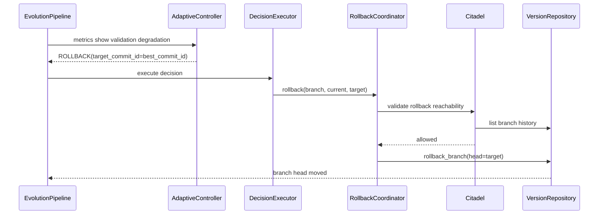

### Example: Experimental Branch Creation

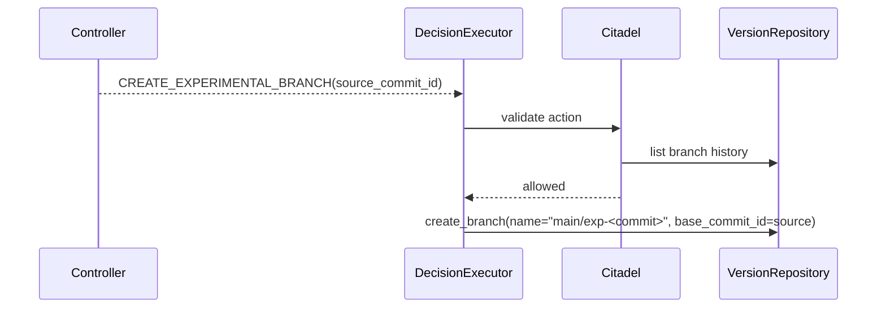

### Example: Continual Stage Dataset With Replay

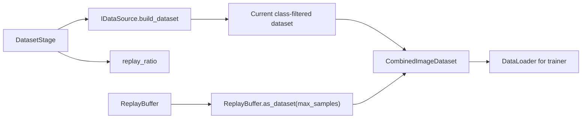

## Review Recommendations

1. Wire dashboard backend to repositories before expanding UI features.
2. Implement worker queue semantics with Redis or remove Redis from the critical path until needed.
3. Add transaction boundaries around checkpoint+commit+experiment updates.
4. Add authentication before exposing override/rollback endpoints.
5. Introduce artifact storage abstraction before treating MinIO as supported.
6. Add real PostgreSQL integration tests for migrations and repository behavior.
7. Add a real Fashion-MNIST E2E smoke experiment separate from synthetic CI.
8. Keep neural controller experimental until it has a reproducible offline policy dataset.
9. Remove or document empty namespaces before they become dumping grounds.
10. Generate frontend types from OpenAPI or share a schema contract to prevent drift.
