# ACN Architecture Map

Date: 2026-05-18  
Scope: current ACN modular monolith.

This document is a graph-first map of ACN dependencies and runtime flows. It is intentionally concise and complements the deeper audit in `docs/ARCHITECTURE_AUDIT.md`.

## 1. Package Dependency Graph

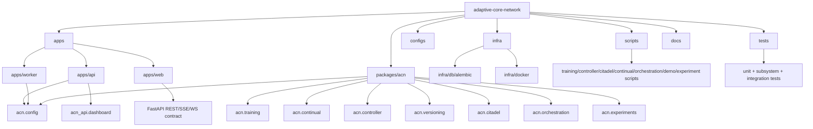

Explanation:
- `apps/*` are deployable/process boundaries.
- `packages/acn/src/acn/*` contains the modular monolith core.
- `infra/*` contains local runtime infrastructure and migrations.
- `scripts/*` are executable examples and reproducible workflows.
- `tests/*` validate subsystem boundaries and selected integration paths.

## 2. Module Dependency Graph

```mermaid
flowchart TD
    API["apps/api/acn_api"] --> Config["acn.config"]
    API --> DashboardRouter["acn_api.dashboard"]

    Worker["apps/worker/acn_worker"] --> Config

    Web["apps/web"] --> DashboardREST["GET /api/v1/dashboard/snapshot"]
    Web --> DashboardSSE["GET /api/v1/dashboard/events"]
    Web --> DashboardWS["WS /api/v1/dashboard/ws"]
    Web --> OverrideREST["POST /api/v1/overrides"]

    Experiments["acn.experiments"] --> Continual["acn.continual"]
    Experiments --> Controller["acn.controller"]
    Experiments --> Citadel["acn.citadel"]
    Experiments --> Versioning["acn.versioning"]

    Orchestration["acn.orchestration"] --> Continual
    Orchestration --> Controller
    Orchestration --> Citadel
    Orchestration --> Versioning

    Citadel --> ControllerDomain["acn.controller.domain"]
    Citadel --> VersionRepo["acn.versioning.repository"]
    Citadel --> VersionModels["acn.versioning.models"]

    Controller --> ControllerDomain
    NeuralController["acn.controller.neural"] --> ControllerPolicies["acn.controller.policies"]
    NeuralController --> ControllerDomain

    Continual --> ContinualDataset["acn.continual.dataset"]
    Continual --> ContinualStage["acn.continual.stage"]
    Continual --> Replay["acn.continual.replay"]
    Continual --> Stream["acn.continual.stream"]

    Training["acn.training"] --> TrainingConfig["acn.training.config"]
    Training --> Checkpointing["acn.training.checkpointing"]
    Training --> Optimizers["acn.training.optimizers"]
    Training --> Schedulers["acn.training.schedulers"]
    Training --> Freezing["acn.training.freezing"]

    Versioning --> VersionDomain["acn.versioning.domain"]
    Versioning --> VersionModels

    Orchestration --> OrchModels["acn.orchestration.models"]
    Orchestration --> OrchRepo["acn.orchestration.repository"]

    Config --> Settings["acn.config.settings"]
    Config --> Logging["acn.config.logging"]
```

Explanation:
- `acn.training` is intentionally isolated from `controller`, `citadel`, `versioning`, `orchestration`, API and UI.
- `acn.controller` is decision-only and does not execute mutations.
- `acn.citadel` validates controller actions against version history.
- `acn.orchestration` is the main composition layer across stage training, versioning, controller decisions and safety validation.

## 3. Clean Architecture Boundary Map

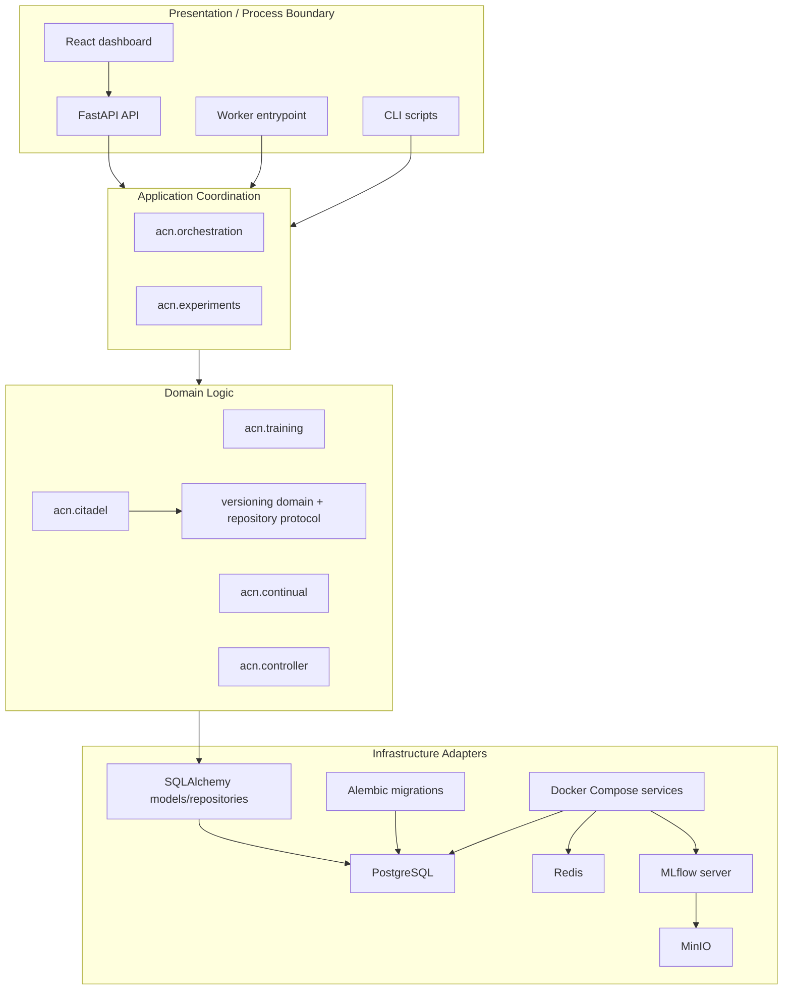

Explanation:
- The intended dependency direction is inward from process/adapters to application/domain.
- Current code mostly follows this, with SQLAlchemy repositories located inside domain-specific packages.
- Redis, MLflow and MinIO are provisioned infrastructure but are not fully used by application code yet.

## 4. Runtime Interaction Graph

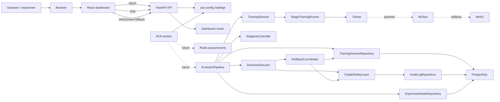

Explanation:
- Solid arrows represent implemented or directly available interactions.
- Dotted arrows represent intended but incomplete runtime integration.
- The worker process currently logs startup only and does not consume Redis jobs.
- The dashboard backend currently emits empty contract data, not repository-backed state.

## 5. Training Flow Graph

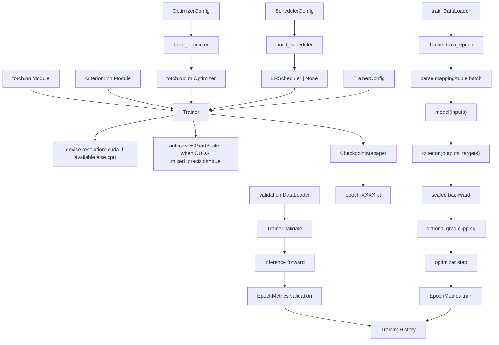

Explanation:
- The trainer is reusable and API-agnostic.
- Checkpoints include model, optimizer, scheduler, scaler and trainer state.
- The trainer does not currently emit MLflow metrics or orchestration events.

## 6. Continual Learning Flow Graph

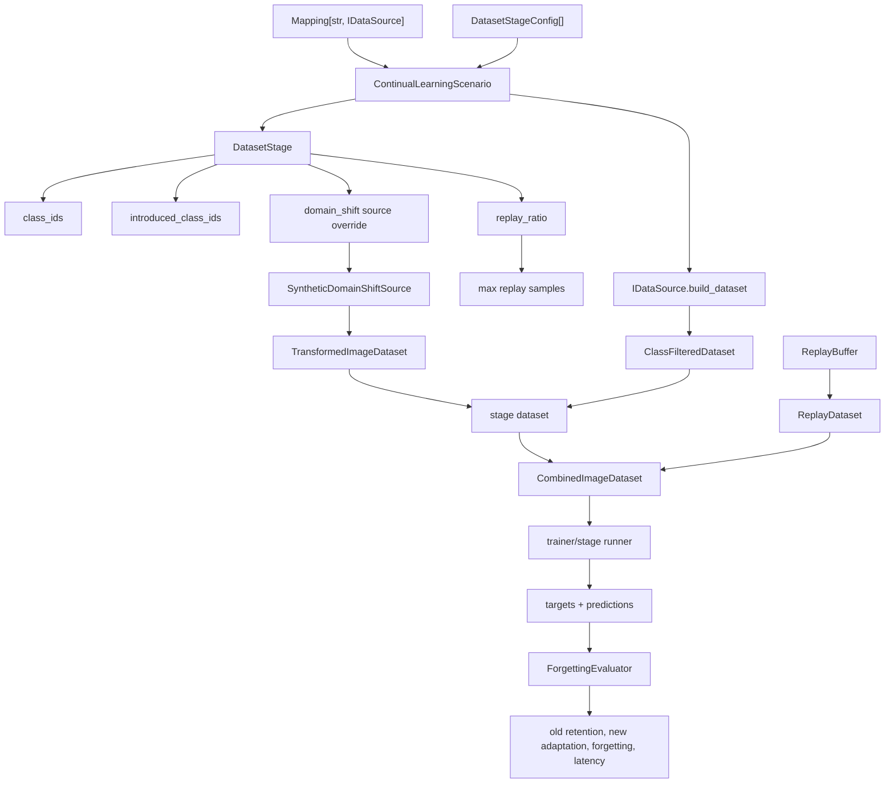

Explanation:
- `IDataSource` decouples scenario logic from concrete datasets.
- Replay is composed as a normal Dataset, so the trainer remains decoupled.
- Stream sources can produce Dataset snapshots but are not part of real-time training yet.

## 7. Version Store Graph

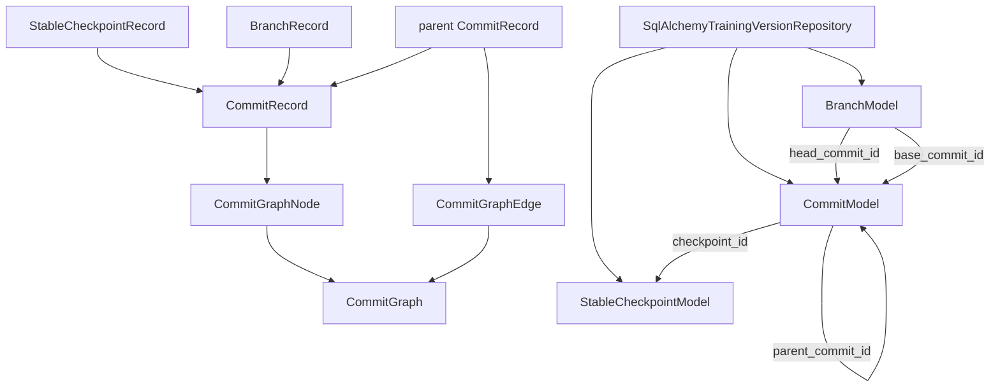

Explanation:
- Versioning models Git-like lineage, not Git storage.
- Stable checkpoints are immutable through SQLAlchemy update/delete guards.
- Rollback is implemented as moving a branch head to a reachable ancestor commit.

## 8. Orchestration Graph

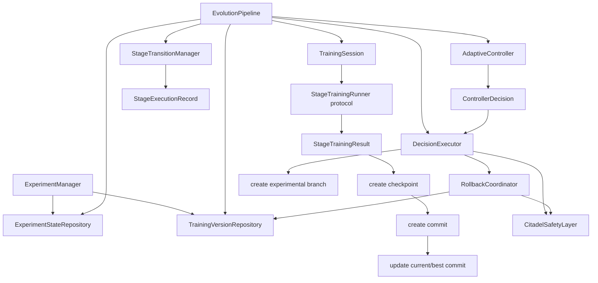

Explanation:
- `EvolutionPipeline` is the central application coordinator.
- `TrainingSession` adapts an async stage runner; it does not know trainer internals.
- `DecisionExecutor` is responsible for routing controller decisions into safe mutations.

## 9. Orchestration Sequence

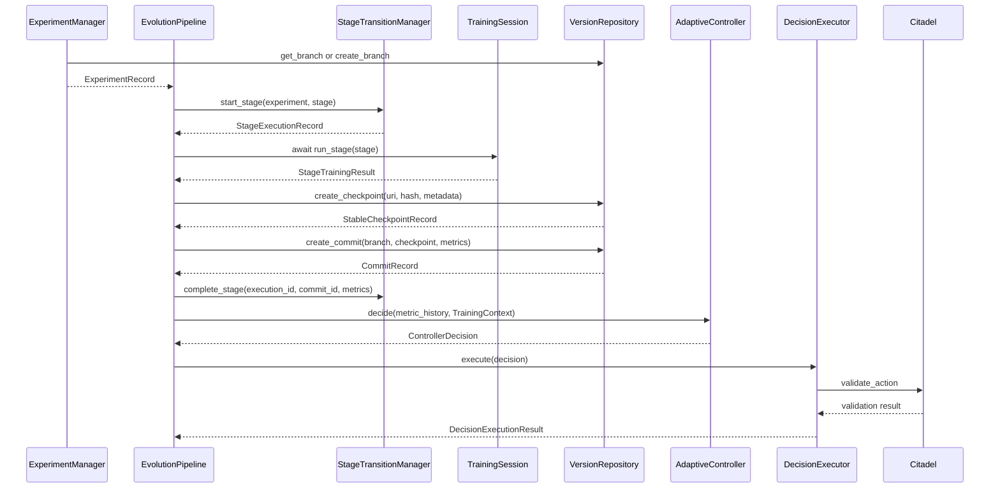

Explanation:
- The sequence is implemented for orchestration tests and synthetic pipelines.
- Real worker-backed execution and persistent dashboard events are not implemented yet.

## 10. Controller Decision Graph

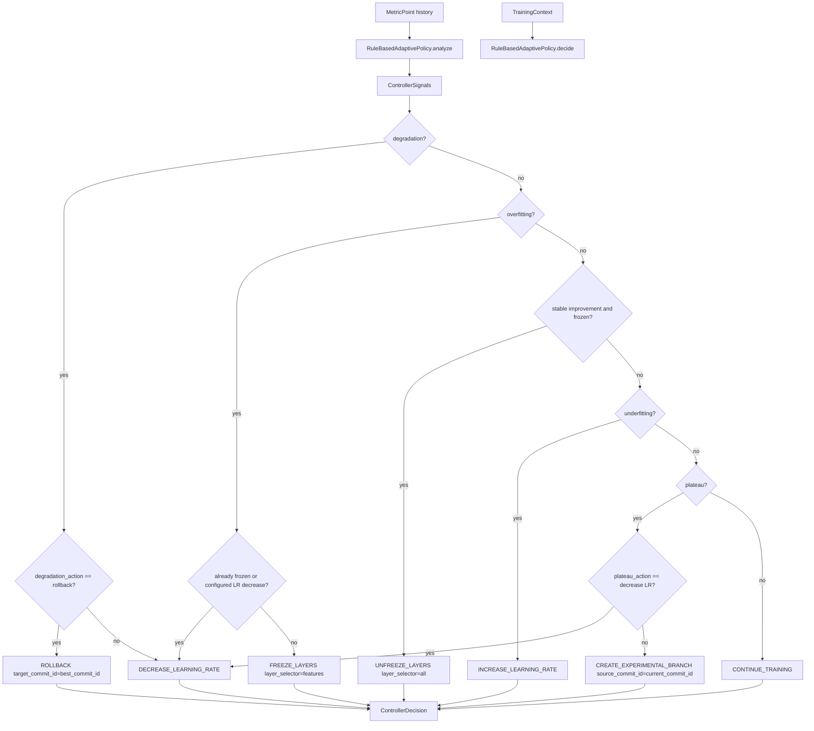

Explanation:
- Rule-based decisions are explainable and priority-ordered.
- Decisions are not executed by the controller.
- Citadel and `DecisionExecutor` handle mutation safety and execution routing.

## 11. Neural Controller Graph

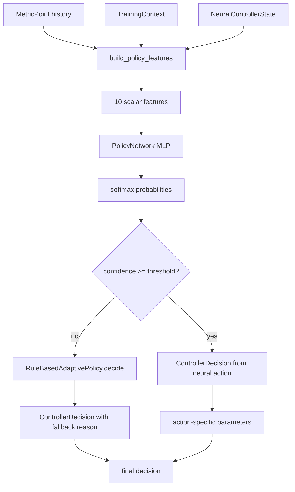

Explanation:
- Neural policy is a small MLP optimized for lightweight offline training/inference.
- It falls back to rule-based decisions when confidence is low.
- It is not currently the default `AdaptiveController` implementation.

## 12. Citadel Validation Graph

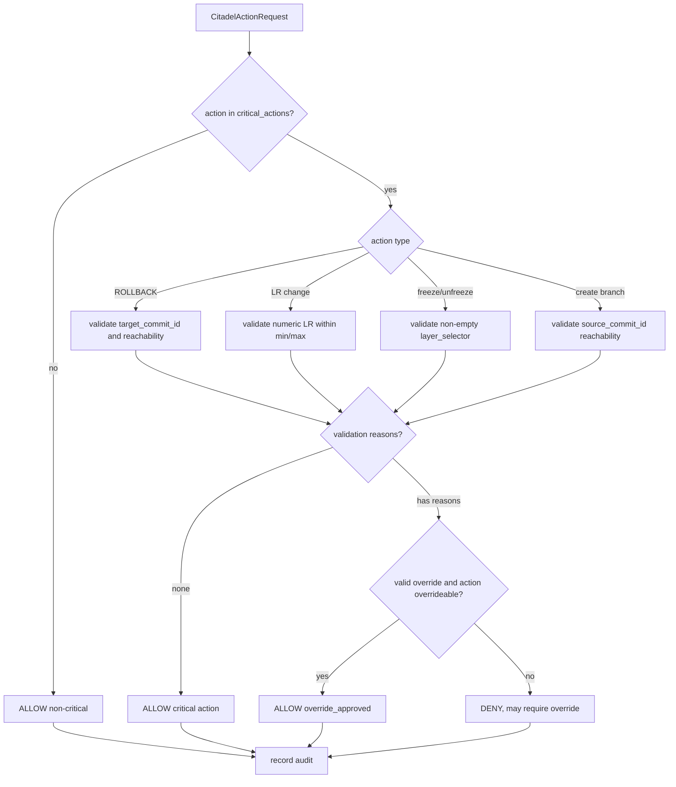

Explanation:
- Citadel is the safety gate for critical controller actions.
- Current enforcement depends on callers routing actions through Citadel.
- Audit logs are supported in memory and via SQLAlchemy.

## 13. Dashboard Interaction Graph

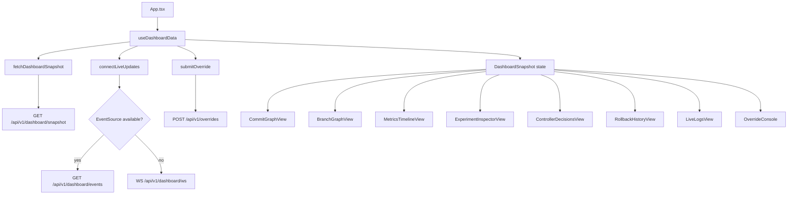

Explanation:
- Frontend is contract-driven and typed with `DashboardSnapshot`.
- Current backend provides empty contract data.
- Demo mode bypasses live API data and uses deterministic preset playback.

## 14. Database Map

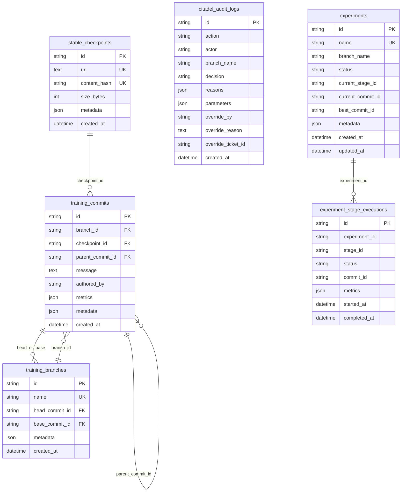

Explanation:
- Versioning schema has real relational constraints.
- Citadel audit and experiment state are less relationally strict.
- Experiment commit/branch references are string fields, not enforced FKs.

## 15. Infrastructure Map

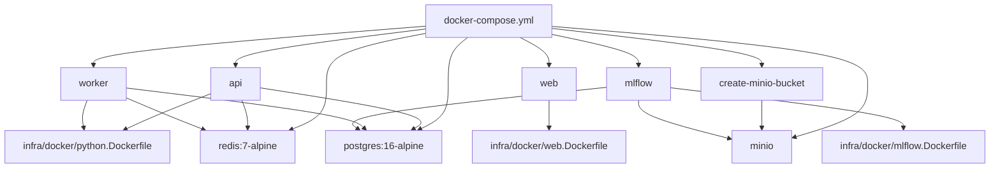

Explanation:
- Compose provides the full intended local stack.
- Redis, MLflow and MinIO are infrastructure-ready but not materially used by core ACN flows.
- The web service currently serves Vite, not a production static build.

## 16. Testing Map

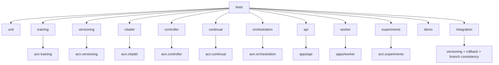

Explanation:
- Tests are organized by subsystem and mostly isolated.
- Current coverage is high for implemented code, but not proof of production runtime readiness.
- Missing areas: frontend tests, PostgreSQL integration tests, Redis/worker queue tests, MLflow/MinIO tests, GPU tests.

## 17. Critical Architectural Edges

These edges matter most for future changes:

```text
Trainer must not depend on:
  API, UI, controller, Citadel, versioning, orchestration.

Controller must not execute:
  rollback, branch creation, checkpoint mutation, optimizer mutation directly.

Citadel should guard:
  rollback, branch creation, freeze/unfreeze, LR changes, checkpoint registration.

Orchestration may coordinate:
  training session, version repository, controller, Citadel, rollback coordinator.

Dashboard should depend on:
  HTTP/event contracts only.

Worker should eventually own:
  long-running training/orchestration execution.
```

## 18. Current Reality vs Intended Map

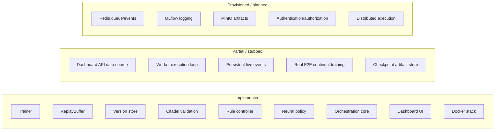

Explanation:
- The codebase has strong internal boundaries.
- Runtime integration is the main unfinished area.
- External reviewers should distinguish implemented contracts from operationally wired behavior.

