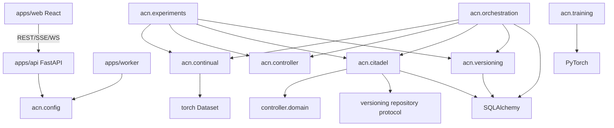
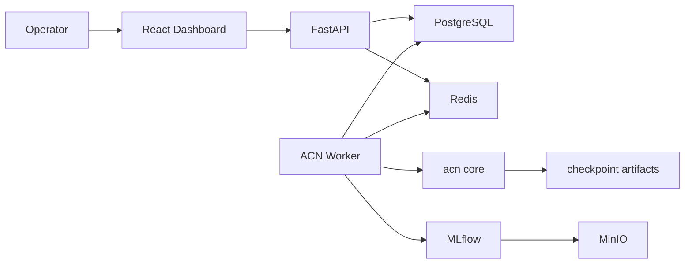
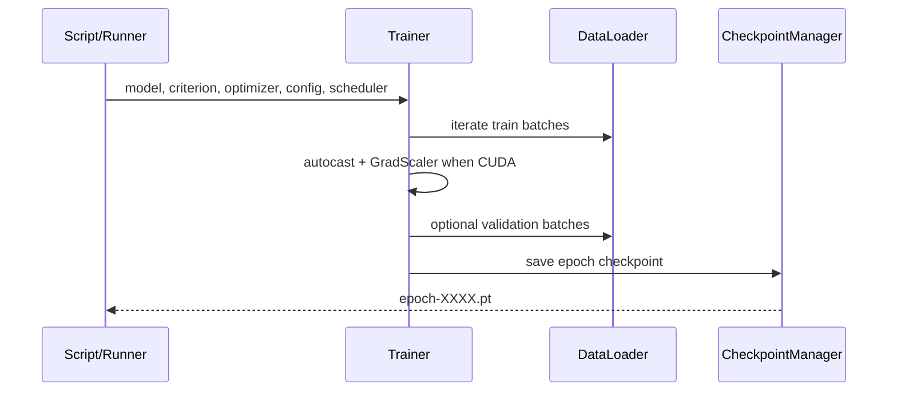
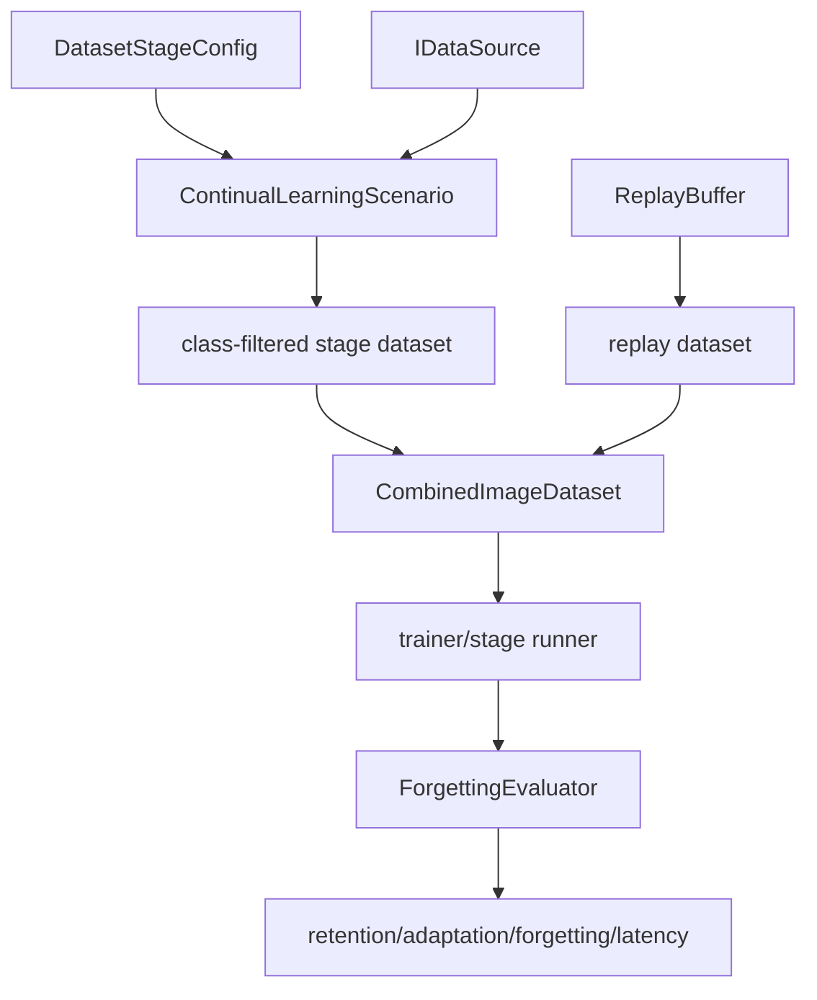
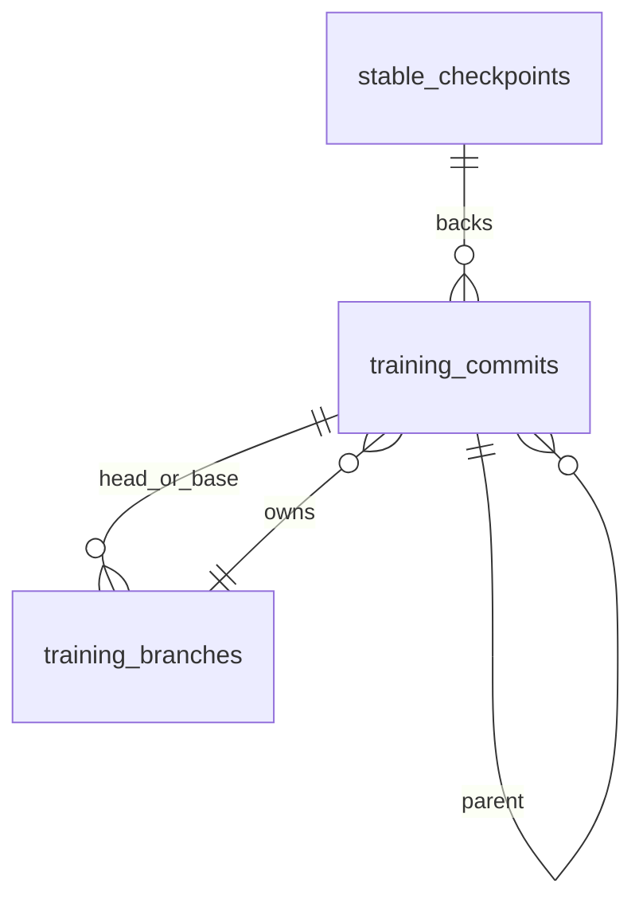
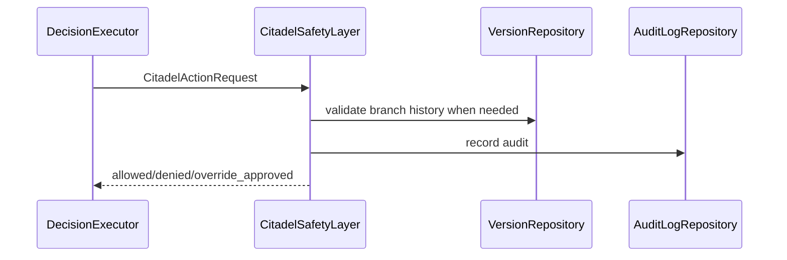
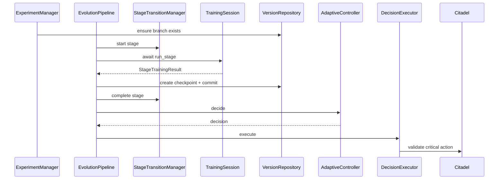

# ACN LLM Review Package

Дата: 2026-05-18  
Назначение: сжатый пакет для внешнего LLM-review архитектуры и реализации ACN.  
Статус: проект является хорошо структурированным прототипом modular monolith, но не production-ready training platform.

## 0. Ключевой Вердикт

ACN имеет правильные доменные границы:

- trainer не знает про API/UI/DB/controller;
- controller принимает метрики и возвращает решения, но не исполняет их;
- Citadel валидирует критические действия;
- version store хранит commit/branch/checkpoint graph;
- orchestrator координирует stage training, commits, controller decisions, rollback;
- dashboard зависит от REST/SSE/WebSocket contracts, не импортирует backend-код.

Главные проблемы:

- API dashboard пока contract-stub: возвращает пустой snapshot.
- Worker пока startup-stub: нет job queue, Redis usage, orchestration loop.
- Redis, MLflow, MinIO есть в Docker Compose, но почти не используются кодом.
- E2E/research/demo flows в основном synthetic/deterministic, не доказывают реальное continual learning качество.
- Нет auth/authz, что критично для rollback/override.
- Нет транзакционной оболочки вокруг multi-step training evolution operations.
- Нет реальной связи rollback с загрузкой model checkpoint weights.

## 1. Критичная Структура Репозитория

```text
apps/
  api/src/acn_api/
    main.py              FastAPI app factory, health, router mounting
    dashboard.py         dashboard REST/SSE/WS contract stub
  worker/src/acn_worker/
    main.py              worker startup logging only
  web/src/
    App.tsx              dashboard shell and navigation
    api/                 REST/live update clients
    views/               commit graph, branch graph, metrics, logs, rollback, override
    demo/                static demo preset

packages/acn/src/acn/
  training/              PyTorch trainer, checkpointing, optimizers, schedulers, freezing
  continual/             data sources, stages, replay, forgetting evaluator, stream abstractions
  controller/            rule-based policy, neural policy, decision domain
  versioning/            SQLAlchemy commit/branch/checkpoint version store
  citadel/               safety validation and audit logs
  orchestration/         experiment manager, pipeline, decision executor, rollback coordinator
  experiments/           synthetic E2E and research benchmark utilities
  config/                settings and logging
  domain/                empty namespace
  infrastructure/        empty namespace
  services/              empty namespace

infra/
  db/alembic/versions/   migrations for versioning, citadel audit, experiment state
  docker/                Python, web, MLflow Dockerfiles

tests/
  api, citadel, continual, controller, demo, experiments,
  integration, orchestration, training, unit, versioning, worker
```

Non-source artifacts observed:

- `reports/coverage/*`
- `.coverage`
- downloaded Fashion-MNIST data
- local checkpoint files
- frontend `tsconfig.tsbuildinfo`
- local Python/Node cache dirs may exist in workspace

Review concern: ensure `.gitignore` excludes generated/runtime artifacts before commit.

## 2. Dependency Boundary Graph



Boundary quality:

- Good: `acn.training` is cleanly isolated.
- Good: frontend does not import backend packages.
- Good: controller is execution-agnostic.
- Acceptable: Citadel depends on controller action enum and version repository.
- Risky: orchestration is async but uses sync repositories.
- Weak: API does not yet bind repositories to dashboard contracts.

## 3. Runtime Architecture

Intended:



Actual current state:

- API exposes health and dashboard contract.
- Worker only logs startup.
- Core modules can run locally and in tests.
- PostgreSQL migrations exist, but tests mostly use SQLite.
- Redis not used.
- MLflow/MinIO not used by trainer/orchestrator.
- Dashboard receives empty snapshot unless demo mode is enabled.

## 4. Core Training Flow



Files:

- `packages/acn/src/acn/training/trainer.py`
- `packages/acn/src/acn/training/checkpointing.py`
- `packages/acn/src/acn/training/config.py`
- `packages/acn/src/acn/training/optimizers.py`
- `packages/acn/src/acn/training/schedulers.py`
- `packages/acn/src/acn/training/freezing.py`

Strengths:

- Generic PyTorch `nn.Module`.
- Mixed precision gated by CUDA.
- Checkpoint includes model/optimizer/scheduler/scaler/state.
- Strict typing and focused modules.

Risks:

- No MLflow logging.
- No artifact store upload.
- No callbacks/events.
- No gradient norm reporting despite neural controller feature.
- No checkpoint trust policy; loading untrusted PyTorch checkpoints is unsafe.

## 5. Continual Learning Flow



Files:

- `packages/acn/src/acn/continual/datasource.py`
- `packages/acn/src/acn/continual/dataset.py`
- `packages/acn/src/acn/continual/stage.py`
- `packages/acn/src/acn/continual/scenario.py`
- `packages/acn/src/acn/continual/evaluation.py`
- `packages/acn/src/acn/continual/replay.py`
- `packages/acn/src/acn/continual/torchvision_sources.py`
- `packages/acn/src/acn/continual/stream.py`

Strengths:

- Reusable dataset source protocol.
- Stage-based incremental class introduction.
- Synthetic domain shift abstraction.
- Replay integrated as Dataset composition.
- Stream abstractions preserve trainer compatibility via Dataset snapshots.

Risks:

- CIFAR-10-C is simulated, not real benchmark integration.
- Replay buffer is in-memory and simple random sampling.
- Forgetting evaluator state is in-memory.
- Stream sources lack real decoder/camera integration.

## 6. Versioning and Rollback



Files:

- `packages/acn/src/acn/versioning/domain.py`
- `packages/acn/src/acn/versioning/models.py`
- `packages/acn/src/acn/versioning/repository.py`
- `infra/db/alembic/versions/20260516_0001_create_training_version_store.py`

Tables:

- `stable_checkpoints`
- `training_branches`
- `training_commits`

Strengths:

- Repository protocol.
- Commit graph with parent-child relations.
- Branch head rollback requires target reachable from current head.
- Stable checkpoint ORM event blocks update/delete.

Risks:

- No multi-parent merge commits.
- No branch promotion/merge/delete lifecycle.
- Reachability loads all commits into memory.
- Immutable checkpoint protection can be bypassed by direct SQL.
- Rollback moves metadata branch head, but does not restore model weights in trainer.
- Experiment references to commits are string fields, no FK constraints.

## 7. Citadel Safety Layer



Files:

- `packages/acn/src/acn/citadel/domain.py`
- `packages/acn/src/acn/citadel/policy.py`
- `packages/acn/src/acn/citadel/audit.py`
- `packages/acn/src/acn/citadel/repository.py`
- `packages/acn/src/acn/citadel/models.py`
- `infra/db/alembic/versions/20260516_0002_create_citadel_audit_logs.py`

Validates:

- rollback target reachable;
- learning rate within bounds;
- layer selector present;
- experimental branch source reachable;
- stable checkpoint overwrite denied;
- override approval for selected actions.

Risks:

- Enforcement is by application convention.
- API override endpoint does not route into Citadel.
- No user identity/authz.
- Audit logs are normal DB rows, not tamper-proof.

## 8. Controllers

### Rule-Based Controller

Files:

- `packages/acn/src/acn/controller/domain.py`
- `packages/acn/src/acn/controller/controller.py`
- `packages/acn/src/acn/controller/policies.py`

Priority order:

1. degradation -> rollback or decrease LR;
2. overfitting -> freeze layers or decrease LR;
3. stable improvement while frozen -> unfreeze;
4. underfitting -> increase LR;
5. plateau -> experimental branch or decrease LR;
6. otherwise -> continue.

Strengths:

- Explainable decisions.
- Configurable thresholds/actions.
- Execution decoupled.

Risks:

- Does not consume forgetting score.
- Can emit rollback with `target_commit_id=None` if no best commit exists.
- Static thresholds only.
- Decision logs are not persisted as first-class entities.

### Neural Controller

Files:

- `packages/acn/src/acn/controller/neural.py`
- `scripts/controller/evaluate_neural_policy.py`
- `scripts/controller/compare_controllers.py`

Inputs:

- train loss;
- validation loss;
- forgetting score;
- rollback count;
- adaptation latency;
- gradient norm;
- learning rate;
- branch history length;
- branch divergence depth;
- frozen flag.

Outputs:

- continue;
- rollback;
- decrease_lr;
- increase_lr;
- freeze_layers;
- unfreeze_layers;
- create_branch.

Strengths:

- Small MLP, GPU-light.
- Offline training path.
- Confidence threshold fallback to rule-based policy.

Risks:

- No real policy training dataset.
- No feature normalization.
- Not integrated behind `AdaptiveController`.
- Explainability is top probability list only.
- Branch graph history is compressed to scalar fields.

## 9. Orchestration



Files:

- `packages/acn/src/acn/orchestration/manager.py`
- `packages/acn/src/acn/orchestration/pipeline.py`
- `packages/acn/src/acn/orchestration/session.py`
- `packages/acn/src/acn/orchestration/stage_transition.py`
- `packages/acn/src/acn/orchestration/decision.py`
- `packages/acn/src/acn/orchestration/rollback.py`
- `packages/acn/src/acn/orchestration/repository.py`
- `packages/acn/src/acn/orchestration/models.py`
- `infra/db/alembic/versions/20260517_0003_create_experiment_state.py`

Strengths:

- `StageTrainingRunner` protocol keeps trainer decoupled.
- Decision execution separated from decision generation.
- Rollback has a dedicated coordinator.
- State repository supports in-memory and SQLAlchemy implementations.

Risks:

- Sync DB repositories inside async pipeline.
- No explicit transaction for checkpoint + commit + experiment update.
- `best_commit_id` update is simplistic.
- LR/freeze/unfreeze decisions are validated but not applied to active trainer.
- No cancellation/retry/idempotency model.

## 10. API and Dashboard

API files:

- `apps/api/src/acn_api/main.py`
- `apps/api/src/acn_api/dashboard.py`

Frontend files:

- `apps/web/src/types/dashboard.ts`
- `apps/web/src/api/dashboardApi.ts`
- `apps/web/src/api/liveUpdates.ts`
- `apps/web/src/hooks/useDashboardData.ts`
- `apps/web/src/views/*`

Endpoints:

```text
GET  /health
GET  /api/v1/dashboard/snapshot
GET  /api/v1/dashboard/events
WS   /api/v1/dashboard/ws
POST /api/v1/overrides
```

Strengths:

- Frontend contract is typed.
- SSE preferred with WebSocket fallback.
- Views cover commit graph, branch graph, metrics, experiment inspector, decisions, rollback, logs, override.
- Demo mode is explicit via `VITE_DEMO_MODE=true`.

Risks:

- Backend snapshot is empty contract data.
- SSE/WS send one snapshot and terminate/close.
- Override API does not mutate Citadel/audit state.
- No auth.
- No CORS/security hardening.
- No frontend tests.

## 11. Database and Migrations

Migrations:

```text
20260516_0001_create_training_version_store.py
20260516_0002_create_citadel_audit_logs.py
20260517_0003_create_experiment_state.py
```

Good:

- JSONB in Postgres migrations.
- ORM uses JSON with PostgreSQL JSONB variants, enabling SQLite tests.
- Versioning tables have useful uniqueness constraints.

Weak:

- Experiment state lacks FKs to commits/branches.
- Audit logs reference branch by string.
- No dashboard decision/event tables.
- No migration/runtime check in app startup.
- No transaction/unit-of-work abstraction.

## 12. Infrastructure

`docker-compose.yml` services:

- `api`
- `worker`
- `web`
- `postgres`
- `redis`
- `minio`
- `create-minio-bucket`
- `mlflow`

Risks:

- `web` runs Vite dev server, not production static serving.
- Default local secrets.
- No GPU runtime configuration.
- No automatic migrations.
- Redis unused.
- MLflow/MinIO unused by app code.
- Docker health/runtime not proven by tests in current audit.

## 13. Tests and Coverage

Test layout:

```text
tests/api
tests/citadel
tests/continual
tests/controller
tests/demo
tests/experiments
tests/integration
tests/orchestration
tests/training
tests/unit
tests/versioning
tests/worker
```

Coverage from `reports/coverage/coverage.xml`:

- line coverage: 90.55%;
- branch coverage: 70.75%.

Package line coverage:

- `citadel`: 92.54%;
- `config`: 100%;
- `continual`: 82.24%;
- `controller`: 89.67%;
- `experiments`: 95.66%;
- `orchestration`: 94.87%;
- `training`: 88.19%;
- `versioning`: 95.95%.

Strong coverage areas:

- versioning repository;
- Citadel validation;
- controller decisions;
- replay buffer;
- orchestration core;
- API contract;
- E2E/research artifact generation.

Weak coverage areas:

- no frontend tests;
- no PostgreSQL integration tests;
- no Redis/worker queue tests;
- no MLflow/MinIO tests;
- no GPU/AMP CUDA tests;
- no browser-level dashboard tests.

## 14. Known Problems

Critical:

- No authentication/authorization for dangerous control surfaces.
- Worker does not execute jobs.
- Dashboard API is not repository-backed.
- Rollback does not load/restore model checkpoint artifacts.
- Redis, MLflow, MinIO are not integrated despite being part of stack.

High:

- No transaction boundary across version/orchestration state mutations.
- Sync repositories in async orchestration.
- Branch creation can name-collide on repeated source commit.
- `best_commit_id` logic is underdeveloped.
- Neural policy has no real training corpus.

Medium:

- Replay buffer is memory-only.
- Commit reachability checks are O(total commits).
- Experiment commit references are weak string fields.
- Stream abstractions are not backed by real video/camera implementation.
- Synthetic E2E may create false confidence.

Low:

- Empty namespaces invite misplaced code.
- Some generated artifacts exist in workspace.
- Dashboard demo data may be mistaken for live backend integration.

## 15. Risky Decisions

| Decision | Why it is risky | Suggested review question |
| --- | --- | --- |
| Provision Redis/MLflow/MinIO before integration | Infra appears more complete than code reality | Should these be marked experimental until wired? |
| Synthetic E2E as default reproducibility path | Tests pass without proving real ML behavior | Is there a separate real-data smoke test? |
| Citadel enforcement by convention | Direct repository calls can bypass safety layer | Should critical repository mutations require Citadel context? |
| Sync SQLAlchemy in async pipeline | Can block event loop under API usage | Should orchestration run only in worker thread/process? |
| Free-form metadata dictionaries | Flexible but weakly validated | Which metadata deserves typed schemas? |
| Static dashboard contract | UI can drift from backend reality | Should OpenAPI-generated TS types be used? |
| Neural controller before data corpus | Can look advanced but be untrustworthy | Should it remain experimental behind feature flag? |

## 16. Technical Debt

Immediate:

- wire dashboard snapshot to repositories;
- implement worker job loop;
- add auth/authz;
- add transaction/unit-of-work around commit + experiment updates;
- route overrides through Citadel and audit repository;
- integrate MLflow logging or remove MLflow from supported claims.

Near-term:

- PostgreSQL integration tests for migrations/repositories;
- frontend tests;
- OpenAPI-to-TypeScript contract generation;
- artifact storage abstraction for checkpoint upload/download;
- branch naming collision handling;
- explicit model registry/identity.

Later:

- replay persistence;
- streaming decoder/camera adapters;
- distributed execution semantics;
- controller decision persistence;
- real CIFAR-10-C integration;
- policy dataset generation for neural controller.

## 17. Scalability Concerns

Commit graph:

- In-memory graph/history scans are fine for small demos, not large experiments.
- Need indexed ancestry queries or materialized graph strategy later.

Replay:

- In-memory tensor storage will not scale to large image/video datasets.
- Need reservoir/prioritized replay and external storage.

Orchestration:

- No distributed locking or idempotent job model.
- No task queue despite Redis.
- No retry/cancellation semantics.

API:

- Dashboard streams are not persistent.
- No pagination for graph/log/history data.
- No auth/rate limiting.

ML artifacts:

- Checkpoint metadata and checkpoint bytes are split but not connected by an artifact service.
- No lifecycle/retention/garbage collection.

GPU:

- Trainer is RTX 3060-friendly, but there is no GPU scheduling/resource ownership model.
- No concurrent experiment guardrails.

## 18. External Reviewer Checklist

Ask these questions first:

1. Can every critical action only happen through Citadel?
2. Can a rollback restore actual model weights, not just branch metadata?
3. Can dashboard data be generated from DB state today?
4. Can the worker execute one end-to-end experiment job from queue to artifacts?
5. Are experiment state changes transactional with version commits?
6. Is there any authenticated identity attached to override approvals?
7. Are MLflow and MinIO actually used by trainer/orchestrator?
8. Are synthetic E2E results clearly separated from real benchmark claims?
9. Can branch names collide under repeated plateau decisions?
10. Can PostgreSQL behavior diverge from SQLite tests?

## 19. Minimal Priority Plan

1. Implement repository-backed dashboard snapshot.
2. Implement worker queue and orchestration job execution.
3. Add auth/authz and route override through Citadel.
4. Add transaction/unit-of-work around experiment evolution.
5. Wire checkpoint artifact upload/download and MLflow metrics.
6. Add PostgreSQL integration tests.
7. Add one real Fashion-MNIST smoke E2E separate from synthetic CI.
8. Add frontend tests for API integration and empty/error states.

